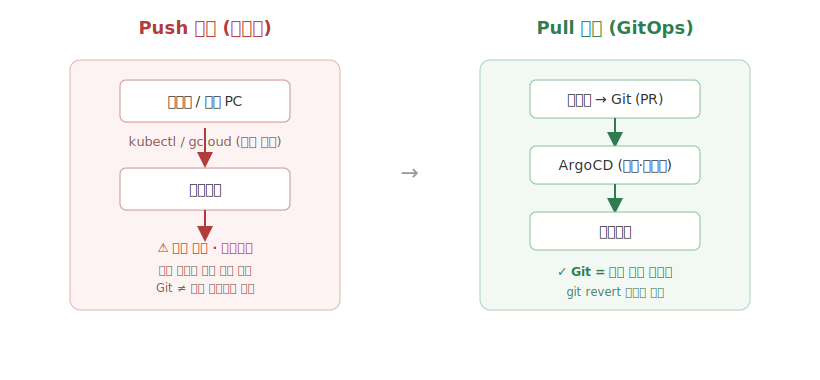
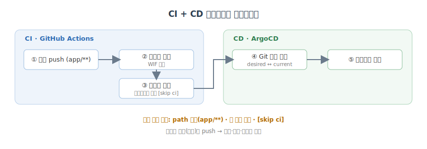

# 첫 배포 파이프라인: 코드 push부터 배포까지

## 개요

2장까지는 `gcloud`와 `kubectl`을 손으로 실행하며 이미지를 빌드하고 배포했다. 편리하지만 반복적이고, 무엇보다 **추적되지 않는다**. 이 장은 그 수작업을 **GitHub Actions(CI)** 와 **ArgoCD(CD)** 로 자동화하여, 코드 push 하나로 빌드부터 배포까지 이어지는 완전한 GitOps 파이프라인을 완성한다.

**이 장의 목표**

- 수동 `gcloud`/`kubectl` 작업을 자동화된 프로세스로 전환한다.
- GitHub Actions와 ArgoCD로 CI/CD 파이프라인을 구성한다.
- Git이 단일 진실 공급원(single source of truth)이 되는 GitOps 원칙을 확립한다.

---

## Push 기반 배포의 한계

수작업 배포의 근본 문제는 **구성 드리프트(configuration drift)** 다. 손으로 이미지를 교체하고 ConfigMap을 바꾸는 순간, Git에 적힌 내용과 실제 클러스터 상태가 어긋나기 시작한다. 클러스터에는 변경 이력이 남지 않으므로, 이전 상태를 알 수 없어 **롤백이 불가능**해진다.

이는 **명령형(imperative)과 선언형(declarative)** 사고의 차이에서 비롯된다. 명령형 명령은 빠르지만 추적이 어렵고, 선언형 방식은 장황하지만 감사(audit)에 유리하다. GitOps는 이 선언형 사고를 확장하여 **"Git에 적힌 것이 곧 클러스터의 상태"** 가 되도록 만든다.



Push 기반이 개발자가 클러스터를 직접 밀어 넣는 구조라면, Pull 기반은 ArgoCD가 Git을 감시하다 변경을 스스로 끌어와 반영하는 구조다. 후자에서는 모든 변경이 커밋으로 남고, 롤백은 `git revert` 한 번으로 성립한다.

### 드리프트를 직접 재현해 보기

말로만 들으면 와닿지 않으니 직접 만들어 본다. 매니페스트에는 `replicas: 2`, 이미지 `v1.0.0`이 적혀 있는데, 급한 마음에 클러스터를 손으로 바꿔 버린다.

```bash
# 명령형: 빠르지만 추적되지 않는 변경
kubectl scale deploy/notiflex-api -n notiflex --replicas=5
kubectl set image deploy/notiflex-api -n notiflex api=.../api:hotfix-x
```

```text
deployment.apps/notiflex-api scaled
deployment.apps/notiflex-api image updated
```

이제 클러스터는 `replicas=5`, 이미지 `hotfix-x`지만 Git에는 여전히 `replicas: 2`, `v1.0.0`이다. 둘을 나란히 비교하면 어긋남이 드러난다.

```bash
kubectl get deploy/notiflex-api -n notiflex \
  -o jsonpath='{.spec.replicas}/{.spec.template.spec.containers[0].image}'; echo
grep -E 'replicas|image:' k8s/deployment.yaml
```

```text
5/asia-northeast3-docker.pkg.dev/.../api:hotfix-x   ← 실제 클러스터
  replicas: 2                                        ← Git 선언
  image: .../api:v1.0.0                              ← Git 선언
```

문제는 여기서 끝이 아니다. `hotfix-x`가 잘못된 빌드였다면, "직전 상태"가 어디에도 기록돼 있지 않아 되돌릴 기준이 없다. 누가·언제·왜 5로 늘렸는지도 알 수 없다. 이것이 **push 기반의 근본 결함**이며, 아래에서 도입할 ArgoCD의 `selfHeal`은 바로 이 손댐(drift)을 감지해 Git 상태로 자동 복원한다.

---

## ArgoCD 설치와 GitOps 연결

배포 자동화 도구를 고르는 단계에서, 클로드 코드는 후보들을 비교한 뒤 **ArgoCD**를 추천했다. 사용성·커뮤니티 규모·도입률 전반에서 가장 균형이 좋다는 판단이었다.

| 도구 | 사용성 | 커뮤니티 | 도입률 | 특징 |
| --- | --- | --- | --- | --- |
| **ArgoCD** | 높음 | 큼 | 높음 | 직관적 UI, 쿠버네티스 네이티브 |
| Flux | 보통 | 큼 | 높음 | CLI/GitOps 중심, UI 미약 |
| Jenkins X | 낮음 | 보통 | 보통 | 파이프라인 복잡 |
| Spinnaker | 낮음 | 보통 | 낮음 | 멀티클라우드 강점, 무거움 |

> 도구 선택의 근거는 `decision-guides/ch3/3.2-gitops-tool.md`에, 설치 실행 절차는 `prompt-guardrails/ch3/3.2-argocd.md`에 정리해 둔다. 결정의 **근거**와 실행의 **절차**를 파일로 분리하는 것이 이 책의 가드레일 방식이다.

설치는 공식 매니페스트로 진행했다.

```bash
kubectl create namespace argocd
kubectl apply -n argocd -f https://raw.githubusercontent.com/argoproj/argo-cd/stable/manifests/install.yaml
kubectl rollout status deploy/argocd-server -n argocd
```

```text
namespace/argocd created
customresourcedefinition.apiextensions.k8s.io/applications.argoproj.io created
customresourcedefinition.apiextensions.k8s.io/appprojects.argoproj.io created
serviceaccount/argocd-application-controller created
deployment.apps/argocd-server created
statefulset.apps/argocd-application-controller created
...
deployment "argocd-server" successfully rolled out
```

설치 직후 컨트롤 플레인 구성 요소가 모두 떴는지 확인한다.

```bash
kubectl get pods -n argocd
```

```text
NAME                                                READY   STATUS    RESTARTS   AGE
argocd-application-controller-0                     1/1     Running   0          90s
argocd-applicationset-controller-6d8f9c7b4-2xk4p    1/1     Running   0          90s
argocd-dex-server-7c9b8d5f6-h9mzt                   1/1     Running   0          90s
argocd-notifications-controller-5f7c9d8b6-qp4wz     1/1     Running   0          90s
argocd-redis-6b8f9c7d5-r3nxk                        1/1     Running   0          90s
argocd-repo-server-84c9f7b6d-8vmnp                  1/1     Running   0          90s
argocd-server-7d8c9f6b5-lk9pq                       1/1     Running   0          90s
```

초기 admin 비밀번호를 확인하고, 포트 포워딩 후 CLI로 로그인한다.

```bash
kubectl -n argocd get secret argocd-initial-admin-secret \
  -o jsonpath="{.data.password}" | base64 -d; echo
kubectl port-forward svc/argocd-server -n argocd 8080:443 &
argocd login localhost:8080 --username admin --insecure
```

```text
'admin:login' logged in successfully
Context 'localhost:8080' updated
```

버전과 접속을 확인한다. 웹 UI(`https://localhost:8080`)로도 같은 상태를 볼 수 있다.

```bash
argocd version --short
argocd cluster list
```

```text
argocd: v2.11.3+3e2a0b1
argocd-server: v2.11.3+3e2a0b1

SERVER                          VERSION  STATUS      MESSAGE
https://kubernetes.default.svc  1.29     Successful
```

> **웹 UI 화면 재구성** — 로그인하면 `Applications` 대시보드가 나온다. 아직 앱이 없어 비어 있고, 앱을 만들면 카드 하나가 생긴다. 카드를 열면 `Application` → `Deployment` → `ReplicaSet` → `Pod` 로 이어지는 리소스 트리가 그려지고, 각 노드에 동기화 상태(`Synced`/`OutOfSync`)와 헬스(`Healthy`/`Progressing`/`Degraded`)가 색으로 표시된다. 우상단 `SYNC`/`REFRESH`/`HISTORY` 버튼으로 수동 동기화·새로고침·이력 조회를 한다.

기존 **PAT(Personal Access Token)** 로 GitHub 저장소를 연결한다. (토큰은 환경변수/시크릿으로 주입하며, 값은 절대 커밋하지 않는다.)

```bash
argocd repo add https://github.com/dustinchae/k8s-claude-07-end.git \
  --username dustinchae --password "$GH_PAT"
```

```text
Repository 'https://github.com/dustinchae/k8s-claude-07-end.git' added
```

그리고 클러스터가 추적할 대상을 `Application` 리소스로 선언한다. `automated` 동기화에 `selfHeal: true`를 주면, 클러스터가 Git에서 벗어날 때 ArgoCD가 스스로 되돌린다 — 드리프트를 구조적으로 막는 핵심 설정이다.

```yaml
# argocd/notiflex-app.yaml
apiVersion: argoproj.io/v1alpha1
kind: Application
metadata:
  name: notiflex
  namespace: argocd
spec:
  project: default
  source:
    repoURL: https://github.com/dustinchae/k8s-claude-07-end.git
    targetRevision: main
    path: k8s
  destination:
    server: https://kubernetes.default.svc
    namespace: notiflex
  syncPolicy:
    automated:
      prune: true
      selfHeal: true
```

```bash
kubectl apply -f argocd/notiflex-app.yaml
argocd app get notiflex
```

```text
Name:            argocd/notiflex
Project:         default
Namespace:       notiflex
URL:             https://localhost:8080/applications/notiflex
Repo:            https://github.com/dustinchae/k8s-claude-07-end.git
Target:          main
Path:            k8s
Sync Policy:     Automated (Prune, SelfHeal)
Sync Status:     Synced to main (a1b2c3d)
Health Status:   Healthy

GROUP  KIND        NAMESPACE  NAME          STATUS  HEALTH
       Service     notiflex   notiflex-api  Synced  Healthy
apps   Deployment  notiflex   notiflex-api  Synced  Healthy
```

### selfHeal 검증: 손댐이 자동으로 되돌아온다

앞서 만든 드리프트(`replicas=5`)가 이제 어떻게 되는지 보자. `selfHeal: true`가 켜진 상태에서 다시 손으로 스케일을 바꾸면, ArgoCD가 감지해 Git 값(`replicas: 2`)으로 되돌린다.

```bash
kubectl scale deploy/notiflex-api -n notiflex --replicas=5
# 몇 초 후
kubectl get deploy/notiflex-api -n notiflex
```

```text
deployment.apps/notiflex-api scaled
NAME           READY   UP-TO-DATE   AVAILABLE   AGE
notiflex-api   2/2     2            2           12m     ← 5가 아니라 2로 복원됨
```

ArgoCD 이벤트에도 자동 복원 기록이 남는다.

```bash
argocd app get notiflex | grep -A2 "CONDITION\|OperationState"
kubectl get events -n notiflex --field-selector reason=Killing --sort-by=.lastTimestamp | tail -1
```

```text
OperationState: Succeeded (SelfHeal)   Automated sync to a1b2c3d
5s   Normal  Killing  pod/notiflex-api-...  Stopping container api (drift 복원)
```

이로써 "Git 저장소 ↔ 클러스터"의 동기화 채널이 열렸고, 이제 클러스터는 손으로 바꿔도 **항상 Git으로 수렴**한다.

---

## ArgoCD 롤링 업데이트: git push 만으로 배포

연결이 끝났으니 실제로 "코드를 Git에 밀어 넣기만 하면 배포되는지" 확인할 차례다. API에 애플리케이션 버전, Go 런타임, Pod 이름을 반환하는 `/version` 엔드포인트를 추가했다.

```go
// app/main.go
http.HandleFunc("/version", func(w http.ResponseWriter, r *http.Request) {
    resp := map[string]string{
        "app":       "notiflex-api",
        "version":   os.Getenv("APP_VERSION"),
        "goRuntime": runtime.Version(),
        "pod":       os.Getenv("POD_NAME"), // downward API로 주입
    }
    w.Header().Set("Content-Type", "application/json")
    _ = json.NewEncoder(w).Encode(resp)
})
```

Pod 이름을 응답에 담기 위해, Deployment는 downward API로 `POD_NAME`을 주입하고 롤링 업데이트 전략을 명시한다.

```yaml
# k8s/deployment.yaml (일부)
spec:
  replicas: 2
  strategy:
    type: RollingUpdate
    rollingUpdate:
      maxSurge: 1
      maxUnavailable: 0        # 무중단: 새 Pod가 뜬 뒤 옛 Pod 종료
  template:
    spec:
      containers:
        - name: api
          image: asia-northeast3-docker.pkg.dev/PROJECT_ID/notiflex/api:v1.1.0
          env:
            - name: APP_VERSION
              value: "v1.1.0"
            - name: POD_NAME
              valueFrom:
                fieldRef:
                  fieldPath: metadata.name
```

이미지를 빌드해 태그를 올리고, 매니페스트의 이미지 태그를 갱신해 커밋·push한다.

```bash
git add app/main.go k8s/deployment.yaml
git commit -m "add /version endpoint, bump image to v1.1.0"
git push origin main
```

ArgoCD가 변경을 감지하면 상태가 `Synced → OutOfSync → Progressing → Synced/Healthy`로 전이한다. 3초 간격으로 조회해 보면 흐름이 보인다.

```bash
watch -n3 'argocd app get notiflex | grep -E "Sync Status|Health Status"'
```

```text
# t+0s
Sync Status:   OutOfSync from main (b2c3d4e)
Health Status: Healthy
# t+3s
Sync Status:   Progressing
Health Status: Progressing
# t+9s
Sync Status:   Synced to main (b2c3d4e)
Health Status: Healthy
```

내부적으로는 새 ReplicaSet이 생기고 옛 ReplicaSet이 0으로 줄어든다.

```bash
kubectl get rs -n notiflex
kubectl rollout status deploy/notiflex-api -n notiflex
```

```text
NAME                      DESIRED   CURRENT   READY   AGE
notiflex-api-6c4f9d2a8    2         2         2       20s     ← 새 버전 v1.1.0
notiflex-api-7d9c8b5f6    0         0         0       12m     ← 이전 버전 v1.0.0

Waiting for deployment "notiflex-api" rollout to finish: 1 old replicas are pending termination...
deployment "notiflex-api" successfully rolled out
```

포트 포워딩으로 응답을 확인해 배포 성공을 검증한다.

```bash
kubectl port-forward -n notiflex svc/notiflex-api 8000:80 &
curl -s localhost:8000/version | jq
```

```json
{
  "app": "notiflex-api",
  "version": "v1.1.0",
  "goRuntime": "go1.22.3",
  "pod": "notiflex-api-7d9c8b5f6-abcde"
}
```

**롤백 전략**은 명령형 되돌리기가 아니라 **`git revert`** 다. 문제가 있는 배포를 되돌릴 때 해당 커밋을 revert하면, ArgoCD가 다시 Git 상태(이전 버전)로 클러스터를 맞춘다.

```bash
git log --oneline -3
```

```text
a1b2c3d (HEAD -> main) add /version endpoint, bump image to v1.1.0
9f8e7d6 connect argocd application
7c6b5a4 initial deployment manifests
```

```bash
git revert --no-edit a1b2c3d
git push origin main
argocd app history notiflex
```

```text
ID  DATE                 REVISION
0   2026-07-12 10:31:07  a1b2c3d   (v1.1.0)
1   2026-07-12 10:48:22  e4f5a6b   (revert → v1.0.0 복구)
```

복구 후 다시 `/version`을 찔러 보면 버전이 되돌아간 것을 확인할 수 있다. 쿠버네티스의 롤아웃 이력에도 되돌림이 새 리비전으로 기록된다.

```bash
curl -s localhost:8000/version | jq -r '.version'
kubectl rollout history deploy/notiflex-api -n notiflex
```

```text
v1.0.0

REVISION  CHANGE-CAUSE
1         initial deployment
2         image v1.1.0
3         image v1.0.0 (git revert e4f5a6b)
```

롤백조차 Git 이력 안에서 이뤄지는 것이다. 명령형 `kubectl rollout undo`와 달리, 되돌림 자체가 커밋으로 남아 "왜 되돌렸는지"까지 추적된다.

> 실행 절차는 `prompt-guardrails/ch3/3.3-rolling-update.md` 참고.

---

## GitHub Actions CI: 빌드 자동화

배포는 자동화됐지만 한 가지 수작업이 남았다. 코드를 바꿀 때마다 여전히 클로드 코드에 `gcloud builds submit`을 요청해 이미지를 빌드해야 했다. 이 빌드 단계를 **GitHub Actions**로 옮긴다.

핵심은 인증 방식이다. 서비스 계정 키(JSON) 대신 **WIF(Workload Identity Federation)** 를 사용한다. GitHub이 발급한 OpenID 토큰을 GCP의 임시 자격 증명으로 교환하는 방식으로, AWS의 OIDC 접근과 유사하다. **장기 비밀 키를 저장소에 두지 않는다**는 점에서 훨씬 안전하다.

먼저 GCP 쪽에 Workload Identity Pool과 Provider를 만들고, 배포용 서비스 계정에 이 저장소만 신뢰하도록 바인딩한다.

```bash
# Workload Identity Pool + OIDC Provider 생성
gcloud iam workload-identity-pools create github-pool \
  --location=global --display-name="GitHub Actions Pool"

gcloud iam workload-identity-pools providers create-oidc github-provider \
  --location=global --workload-identity-pool=github-pool \
  --issuer-uri="https://token.actions.githubusercontent.com" \
  --attribute-mapping="google.subject=assertion.sub,attribute.repository=assertion.repository"

# 이 저장소(dustinchae/k8s-claude-07-end)만 서비스 계정 사용 허용
gcloud iam service-accounts add-iam-policy-binding \
  gha-deployer@${PROJECT_ID}.iam.gserviceaccount.com \
  --role=roles/iam.workloadIdentityUser \
  --member="principalSet://iam.googleapis.com/projects/${PROJECT_NUM}/locations/global/workloadIdentityPools/github-pool/attribute.repository/dustinchae/k8s-claude-07-end"
```

그다음 워크플로를 작성한다. `paths: ['app/**']`로 앱 코드가 바뀔 때만 돌게 하고, WIF로 키 없이 인증한다.

```yaml
# .github/workflows/build.yml
name: build-and-update
on:
  push:
    branches: [main]
    paths: ['app/**']          # 앱 코드가 바뀔 때만 빌드
permissions:
  id-token: write              # WIF 토큰 발급
  contents: write              # 이미지 태그 커밋용
jobs:
  build:
    runs-on: ubuntu-latest
    steps:
      - uses: actions/checkout@v4
      - id: auth
        uses: google-github-actions/auth@v2
        with:
          workload_identity_provider: projects/${{ secrets.PROJECT_NUM }}/locations/global/workloadIdentityPools/github-pool/providers/github-provider
          service_account: gha-deployer@${{ secrets.PROJECT_ID }}.iam.gserviceaccount.com
      - uses: google-github-actions/setup-gcloud@v2
      - name: Build & push image
        run: |
          IMAGE=asia-northeast3-docker.pkg.dev/${{ secrets.PROJECT_ID }}/notiflex/api:${{ github.sha }}
          gcloud builds submit app --tag "$IMAGE"
          echo "IMAGE=$IMAGE" >> "$GITHUB_ENV"
```

> **실전 팁 — 첫 실행은 대개 실패한다.** WIF 바인딩의 `attribute.repository` 값이나 provider 리소스 경로가 한 글자만 어긋나도 인증이 거부된다. 처음엔 이런 로그를 만나기 쉽다.
>
> ```text
> Error: google-github-actions/auth failed with: failed to generate Google Cloud
> federated token for .../providers/github-provider: (403) Permission denied
> on resource (or it may not exist).
> ```
>
> 대개 원인은 (1) `--member`의 저장소 이름 오타, (2) 서비스 계정에 `roles/iam.workloadIdentityUser` 미부여, (3) provider의 `attribute-condition` 누락이다. 바인딩을 다시 확인하면 해결된다.
>
> ```bash
> gcloud iam service-accounts get-iam-policy \
>   gha-deployer@${PROJECT_ID}.iam.gserviceaccount.com --format=json
> ```

바인딩을 바로잡고 다시 push하면, 이번엔 키 파일 없이 임시 자격 증명이 발급되고 빌드가 성공한다.

```text
Run google-github-actions/auth@v2
  Created credentials file at "/home/runner/work/_temp/gha-creds-xxxx.json"
  Using workload identity federation (no service account key)
Run gcloud builds submit app --tag ...
  Creating temporary archive of 12 file(s) totalling 48 KiB before compression.
  Uploading tarball of [app] to [gs://PROJECT_ID_cloudbuild/source/...tgz]
  Created [https://cloudbuild.googleapis.com/v1/projects/PROJECT_ID/builds/8f3c1a2b].
  ...
  Step #0: Pushing asia-northeast3-docker.pkg.dev/.../notiflex/api:abc1234
  DONE
  ID: 8f3c1a2b  STATUS: SUCCESS  DURATION: 1M32S
  IMAGES: asia-northeast3-docker.pkg.dev/.../notiflex/api:abc1234
```

레지스트리에 이미지가 실제로 올라갔는지도 확인한다.

```bash
gcloud artifacts docker images list \
  asia-northeast3-docker.pkg.dev/${PROJECT_ID}/notiflex/api --include-tags --limit=3
```

```text
IMAGE                                           TAGS      CREATE_TIME          SIZE
.../notiflex/api  abc1234   2026-07-12T11:05:00  18.4 MB
.../notiflex/api  v1.1.0    2026-07-12T10:31:00  18.4 MB
.../notiflex/api  v1.0.0    2026-07-12T09:50:00  18.3 MB
```

> 도구 비교는 `decision-guides/ch3/3.4-ci-tool.md`, 실행 절차는 `prompt-guardrails/ch3/3.4-github-actions.md`.

---

## CI + ArgoCD 통합: 빌드에서 배포까지

이제 CI는 이미지를 빌드하고, CD는 Git 변경을 배포한다. 그런데 **둘 사이에 빠진 고리**가 있다. 새로 빌드된 이미지의 태그로 매니페스트를 갱신할 주체가 없다. 사람이 매번 태그를 손으로 바꾼다면 자동화가 반쪽이다.

해결책은 GitHub Actions에 저장소 **쓰기 권한**을 주어, 빌드가 끝나면 새 이미지 태그로 매니페스트를 **자동 커밋·push**하게 하는 것이다. 그러면 ArgoCD가 그 변경을 감지해 배포한다. 앞의 워크플로에 태그 갱신 스텝을 잇는다.

```yaml
      - name: Update manifest image tag
        run: |
          cd k8s
          yq -i '.spec.template.spec.containers[0].image = strenv(IMAGE)' deployment.yaml
          git config user.name  "github-actions[bot]"
          git config user.email "github-actions[bot]@users.noreply.github.com"
          git commit -am "ci: update image to ${{ github.sha }} [skip ci]"
          git push
```



여기서 위험이 하나 생긴다. Actions가 매니페스트를 커밋하면, 그 커밋이 다시 Actions를 트리거해 **무한 루프**에 빠질 수 있다. 세 겹으로 방지한다.

- **path 필터** `app/**`: 앱 코드가 바뀔 때만 빌드가 돈다. 매니페스트만 바뀐 커밋은 무시된다.
- **GitHub 봇 재귀 방지**: 기본 토큰으로 만든 커밋은 워크플로를 재트리거하지 않는다.
- **`[skip ci]`** 지시어: 자동 커밋 메시지에 넣어 CI를 건너뛴다.

코드 수정 → 빌드 → 태그 갱신 → 자동 배포까지 전 구간을 실제로 테스트하여 파이프라인을 검증했다. `app/main.go`를 한 줄 고쳐 push하자, 이후는 손대지 않아도 배포까지 자동으로 흘러갔다.

```bash
# ① 앱 코드 한 줄 수정 후 push (사람이 하는 유일한 동작)
git commit -am "feat: version 라벨 문구 변경"
git push origin main
```

CI가 이미지를 빌드하고 태그를 자동 커밋한다. 커밋으로 매니페스트가 어떻게 바뀌는지는 diff에 그대로 드러난다.

```diff
# k8s/deployment.yaml
-          image: asia-northeast3-docker.pkg.dev/PROJECT_ID/notiflex/api:v1.1.0
+          image: asia-northeast3-docker.pkg.dev/PROJECT_ID/notiflex/api:abc1234
```

이 자동 커밋은 `[skip ci]`와 path 필터 덕분에 다시 빌드를 트리거하지 않는다.

```text
[main e4f5a6b] ci: update image to abc1234 [skip ci]
 1 file changed, 1 insertion(+), 1 deletion(-)
Author: github-actions[bot] <github-actions[bot]@users.noreply.github.com>
```

만약 방지책이 없었다면 아래처럼 무한 루프가 돌았을 것이다 — 이 로그를 만나면 방지 3종이 빠졌다는 신호다.

```text
run #41  push app/main.go       → build → commit manifest
run #42  push k8s/deployment.yaml → build → commit manifest   ⚠ 멈추지 않음
run #43  push k8s/deployment.yaml → build → commit manifest   ⚠ ...
```

ArgoCD가 그 커밋을 감지해 동기화하고, 새 Pod가 뜬다.

```bash
argocd app get notiflex --refresh
kubectl get pods -n notiflex
```

```text
Sync Status:   Synced to main (e4f5a6b)
Health Status: Healthy

NAME                            READY   STATUS    RESTARTS   AGE
notiflex-api-6c4f9d2a8-k2m9p    1/1     Running   0          22s
notiflex-api-6c4f9d2a8-q7x4t    1/1     Running   0          19s
```

전 구간을 시간순으로 놓고 보면, 사람의 개입이 첫 push 한 번뿐이라는 게 분명해진다.

```text
11:05:00  [사람]  git push app/main.go
11:05:04  [CI]    build.yml 트리거 (paths: app/**)
11:06:36  [CI]    이미지 빌드·push 완료 → api:abc1234
11:06:40  [CI]    deployment.yaml 태그 갱신 커밋 (e4f5a6b) [skip ci]
11:06:41  [CI]    ↳ path 필터·[skip ci]로 재트리거 안 됨
11:06:55  [ArgoCD] OutOfSync 감지 → 자동 동기화 시작
11:07:10  [ArgoCD] Synced / Healthy — 새 Pod 2개 Running
```

사람이 한 일은 코드 한 줄 push뿐이고, 빌드·태그·배포는 전부 자동으로 이어졌다.

> 실행 절차는 `prompt-guardrails/ch3/3.5-ci-argocd.md`.

---

## 심화: 운영을 넓히는 확장 패턴

단일 환경·단일 매니페스트로 파이프라인이 돌기 시작했으니, 실제 운영에서 곧바로 필요해지는 네 가지 확장을 얹는다. 모두 **Git에 선언하고 ArgoCD가 반영**하는 동일한 원칙 위에서 동작한다.

### Kustomize로 dev/prod 분리

환경마다 매니페스트를 통째로 복제하면 곧 드리프트가 난다. Kustomize는 공통 `base`에 환경별 `overlay`로 차이(레플리카 수, 이미지 태그 등)만 덧씌운다.

```text
k8s/
├── base/
│   ├── deployment.yaml
│   ├── service.yaml
│   └── kustomization.yaml
└── overlays/
    ├── dev/kustomization.yaml
    └── prod/kustomization.yaml
```

```yaml
# k8s/overlays/prod/kustomization.yaml
resources:
  - ../../base
patches:
  - target: { kind: Deployment, name: notiflex-api }
    patch: |-
      - op: replace
        path: /spec/replicas
        value: 4                    # prod는 4개, dev는 base의 2개
images:
  - name: asia-northeast3-docker.pkg.dev/PROJECT_ID/notiflex/api
    newTag: v1.1.0
```

적용 전 렌더링 결과를 미리 확인한다.

```bash
kubectl kustomize k8s/overlays/prod | grep -E "replicas|image:"
```

```text
  replicas: 4
  image: asia-northeast3-docker.pkg.dev/PROJECT_ID/notiflex/api:v1.1.0
```

ArgoCD `Application`은 `path`만 `k8s/overlays/prod`로 가리키면 된다. ArgoCD는 Kustomize를 자동 인식한다.

### ApplicationSet으로 환경 자동 생성

환경이 둘 이상이면 `Application`을 하나씩 만드는 것도 반복이다. **ApplicationSet**은 제너레이터로 여러 앱을 한 번에 찍어낸다.

```yaml
# argocd/notiflex-appset.yaml
apiVersion: argoproj.io/v1alpha1
kind: ApplicationSet
metadata:
  name: notiflex-envs
  namespace: argocd
spec:
  generators:
    - list:
        elements:
          - { env: dev,  namespace: notiflex-dev }
          - { env: prod, namespace: notiflex-prod }
  template:
    metadata:
      name: 'notiflex-{{env}}'
    spec:
      project: default
      source:
        repoURL: https://github.com/dustinchae/k8s-claude-07-end.git
        targetRevision: main
        path: 'k8s/overlays/{{env}}'
      destination:
        server: https://kubernetes.default.svc
        namespace: '{{namespace}}'
      syncPolicy:
        automated: { prune: true, selfHeal: true }
```

```bash
kubectl apply -f argocd/notiflex-appset.yaml
argocd app list
```

```text
applicationset.argoproj.io/notiflex-envs created

NAME           SYNC STATUS  HEALTH   PATH                 NAMESPACE
notiflex-dev   Synced       Healthy  k8s/overlays/dev     notiflex-dev
notiflex-prod  Synced       Healthy  k8s/overlays/prod    notiflex-prod
```

원소 목록에 `staging` 한 줄만 추가하면 새 환경 앱이 저절로 생긴다. 환경 증설이 **선언 한 줄**로 끝난다.

### Sync Waves로 배포 순서 제어

ConfigMap이 아직 없는데 Deployment가 먼저 뜨면 Pod가 기동에 실패한다. **Sync Wave** 애노테이션으로 순서를 강제한다(작은 수가 먼저).

```yaml
# ConfigMap: 가장 먼저
metadata:
  annotations:
    argocd.argoproj.io/sync-wave: "-1"
---
# Deployment: 그다음
metadata:
  annotations:
    argocd.argoproj.io/sync-wave: "0"
---
# Ingress: 마지막
metadata:
  annotations:
    argocd.argoproj.io/sync-wave: "1"
```

동기화 로그에 웨이브 순서가 그대로 찍힌다.

```bash
argocd app sync notiflex-prod
```

```text
Syncing app notiflex-prod
  Wave -1  ConfigMap/notiflex-config     Synced
  Wave  0  Deployment/notiflex-api       Synced   Progressing → Healthy
  Wave  1  Ingress/notiflex              Synced
Operation Succeeded
```

DB 마이그레이션처럼 "배포 전 1회 실행"이 필요하면 **PreSync 훅**을 쓴다. Job이 성공해야 다음 웨이브로 넘어간다.

```yaml
# migration Job
metadata:
  annotations:
    argocd.argoproj.io/hook: PreSync
    argocd.argoproj.io/hook-delete-policy: HookSucceeded
```

```text
  PreSync  Job/db-migrate  Running → Succeeded (12s)
  Wave  0  Deployment/notiflex-api  Synced
```

### Slack 배포 알림 연동

배포가 자동이 되면 "언제 나갔는지"를 팀이 알아야 한다. ArgoCD Notifications로 동기화 성공/실패를 Slack에 보낸다. 트리거와 템플릿은 ConfigMap으로 선언한다.

```yaml
# argocd-notifications-cm
apiVersion: v1
kind: ConfigMap
metadata:
  name: argocd-notifications-cm
  namespace: argocd
data:
  service.slack: |
    token: $slack-token            # Secret 참조 (값은 커밋 금지)
  trigger.on-sync-succeeded: |
    - when: app.status.operationState.phase in ['Succeeded']
      send: [app-sync-succeeded]
  template.app-sync-succeeded: |
    message: "✅ {{.app.metadata.name}} 배포 완료 · {{.app.status.sync.revision}}"
```

토큰은 매니페스트가 아니라 Secret으로만 주입한다. 환경변수/시크릿 매니저에서 읽어 넣고, **평문 값을 저장소에 커밋하지 않는다.**

```bash
kubectl create secret generic argocd-notifications-secret -n argocd \
  --from-literal=slack-token="$SLACK_BOT_TOKEN"
```

알림을 받을 앱에 구독 애노테이션을 단다.

```yaml
metadata:
  annotations:
    notifications.argoproj.io/subscribe.on-sync-succeeded.slack: notiflex-deploy
```

이후 배포가 끝나면 채널에 메시지가 도착한다.

```text
#notiflex-deploy
✅ notiflex-prod 배포 완료 · e4f5a6b
```

이렇게 확장해도 바뀐 것은 없다. 새 환경도, 배포 순서도, 알림도 전부 **Git에 선언된 상태**일 뿐이며, 사람은 여전히 "무엇을 원하는가"만 커밋한다.

---

## 마무리: CLAUDE.md에 행동 규칙 추가

파이프라인이 완성됐으니, 이 GitOps 원칙을 클로드 코드의 행동 규칙으로 못 박는다. `CLAUDE.md`에 세 가지를 추가했다.

```markdown
## 배포 규칙 (GitOps)
- 클러스터 구성 변경은 반드시 Git을 경유한다. (ArgoCD가 동기화)
- `kubectl apply/delete`, `kubectl edit` 등 클러스터 직접 변경 명령은 거부하고,
  Git 기반 대안 워크플로를 제시한다.
- 변경을 적용하기 전 항상 diff를 먼저 보여주고 승인을 받는다.
```

이후 클러스터를 직접 바꾸라고 요청하면, 클로드 코드는 명령을 실행하는 대신 규칙에 따라 되묻는다.

```text
> notiflex 이미지를 v1.2.0으로 바꿔서 바로 적용해줘

⚠ CLAUDE.md 배포 규칙에 따라 kubectl 직접 적용은 수행하지 않습니다.
  대신 GitOps 흐름을 제안합니다:
    1) k8s/deployment.yaml 의 image 태그를 v1.2.0으로 수정
    2) 변경 diff 확인 후 커밋·push
    3) ArgoCD가 자동 동기화 → 배포
  이 절차로 진행할까요?
```

> 규칙 예시는 `prompt-guardrails/ch3/claudemd-example.md` 참고.

반대로 정상적인 요청(Git 경유)에는 규칙에 따라 diff를 먼저 보여주고 승인을 구한다.

```text
> notiflex 이미지를 v1.2.0으로 올려줘

k8s/deployment.yaml 를 다음과 같이 변경하려 합니다. 적용할까요? (커밋·push → ArgoCD 동기화)

  diff --git a/k8s/deployment.yaml b/k8s/deployment.yaml
  -          image: .../notiflex/api:v1.1.0
  +          image: .../notiflex/api:v1.2.0
```

다만 자연어 규칙은 **강제력이 없다**. 클로드 코드가 규칙을 따르도록 "안내"할 뿐, 기술적으로 "차단"하지는 못한다. 진짜 차단 장치(admission control 등)는 7장에서 다룬다.

---

## 트러블슈팅: 파이프라인이 막히는 흔한 지점

실습에서 실제로 부딪히는 오류와 진단법을 모았다.

### ① ArgoCD가 `OutOfSync`에서 멈춰 있다

자동 동기화가 켜져 있어도 리소스 오류로 진행이 막힐 수 있다. 원인을 먼저 본다.

```bash
argocd app get notiflex
kubectl describe deploy/notiflex-api -n notiflex | tail -15
```

```text
Sync Status: OutOfSync
Health Status: Degraded
...
Events:
  Warning  FailedCreate  replicaset  Error creating: pods "notiflex-api-" is
  forbidden: exceeded quota: mem-limit, requested: 512Mi, used: 1536Mi, limited: 2Gi
```

→ 리소스 쿼터 초과다. `resources.requests`를 낮추거나 쿼터를 조정한 뒤 다시 커밋한다.

### ② Pod가 `ImagePullBackOff`

```bash
kubectl get pods -n notiflex
kubectl describe pod notiflex-api-xxxx -n notiflex | grep -A3 Events
```

```text
NAME                          READY   STATUS             RESTARTS   AGE
notiflex-api-6c4f9d2a8-k2m9p  0/1     ImagePullBackOff   0          40s
...
  Failed to pull image ".../api:abc1234": not found
```

→ 이미지 태그 오타이거나 CI 빌드가 아직 안 끝났다. Artifact Registry에 해당 태그가 실제로 있는지(`gcloud artifacts docker images list`) 확인한다.

### ③ 자동 커밋이 무한 루프

`git log`에 `ci: update image ...` 커밋이 몇 초 간격으로 계속 쌓인다면, 방지 3종(path 필터·봇 재귀 방지·`[skip ci]`) 중 하나가 빠진 것이다. 우선 워크플로를 비활성화해 루프를 끊고 원인을 잡는다.

```bash
gh workflow disable build.yml   # 루프 즉시 차단
git log --oneline -5            # 커밋 폭주 확인
```

### 최종 검증 체크리스트

| 확인 항목 | 명령 | 기대 결과 |
| --- | --- | --- |
| ArgoCD 동기화 | `argocd app get notiflex` | `Synced / Healthy` |
| 앱 응답 | `curl .../version` | 최신 `version` 반환 |
| 이미지 태그 일치 | 매니페스트 image == 배포 Pod image | 동일 |
| CI 트리거 격리 | 매니페스트만 바뀐 커밋 | 빌드 미실행 |
| 드리프트 복원 | 수동 `kubectl scale` | Git 값으로 자동 복원 |

---

## 3장 가드레일 요약

이 장에서 가드레일 파일은 두 갈래로 정리된다.

- `decision-guides/ch3/` — 도구 추천·비교의 근거 (무엇을 왜 골랐는가)
- `prompt-guardrails/ch3/` — 실행 순서 안내 (어떻게 실행하는가)

그리고 이 장에서 하나의 패턴이 뚜렷해진다. 바로 **탐색 → 비교 → 실행**의 3단계 프롬프트 패턴이다.

```text
탐색(Explore)  현재 상태·후보 조사   (비파괴적)
     ↓
비교(Compare)  대안·트레이드오프 제시  (근거 기록)
     ↓
실행(Execute)  승인 후에만 적용        (Git 경유)
```

---

## 핵심 인사이트

- **가드레일을 통한 표준화**: 잘 설계된 가드레일은 환경 차이(OS, 배포 단계)를 흡수하여, 누가 어디서 실행하든 일관된 결과를 만든다.
- **선언형 LLM 사용법**: 사용자는 의도만 제시하고 절차는 시스템이 처리한다. 다만 WIF 인증 선택처럼 **명시하지 않은 판단을 AI가 대신 내리는** 지점은, 프로덕션에서의 완전 자동화 신뢰도에 대한 물음을 남긴다.
- **거버넌스의 긴장**: 자연어 규칙은 안내는 가능하나 강제는 못 한다. 실제 예방은 기술적 통제를 필요로 하며, 이는 이후 장의 과제다.

---