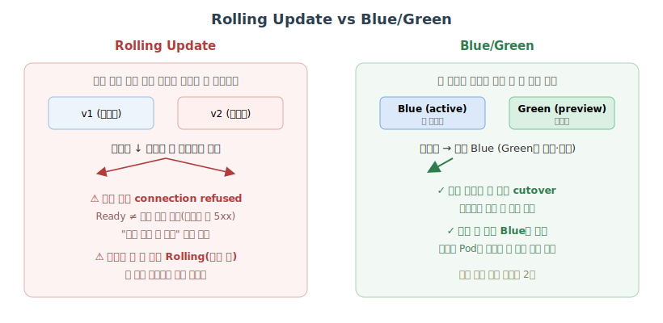
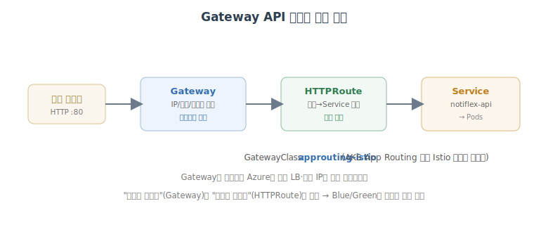
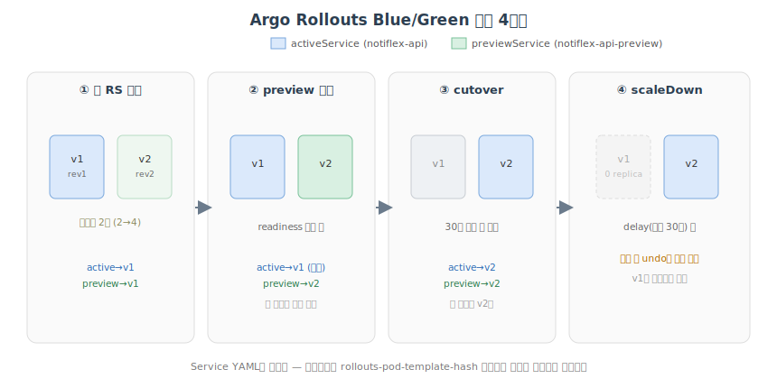

# 무중단 배포: Gateway API와 Blue/Green

## 개요

3장에서 구현한 Rolling Update는 Pod를 하나씩 교체하는 방식이라 "완전 중단"이라 할 만큼 오래 끊기지는 않는다. 다만 운이 나쁜 사용자가 교체되는 순간 요청을 보내면 `connection refused`를 만난다. 더 중요한 문제는 **새 버전에 버그가 있을 때 롤백하는 동안에도 사용자는 계속 새 버전으로 연결된다**는 점이다. "배포 → 버그 발견 → 롤백 시작 → 롤백 완료" 사이의 수십 초 동안 사용자는 에러 페이지를 받는다.

또 하나, 지금까지 Notiflex API에 접근하려면 `kubectl port-forward`를 써야 했다. **외부 IP가 없다.** 실제 서비스라면 도메인과 로드밸런서가 있어야 하는데, 아직 로컬에서만 접근 가능한 상태다.

5장은 이 두 가지를 해결한다. 먼저 **Gateway API**로 외부 진입점을 만들고, 그 위에 **Argo Rollouts**로 **Blue/Green** 배포를 얹는다. (6장에서는 Canary로 한 단계 더 나아간다.)

> **환경 메모** — 이 실습은 **Azure(AKS)** 기준이다. 원서의 GKE 네이티브 구현 대신, AKS App Routing의 경량 Istio(`approuting-istio`)로 Gateway API를 학습한다. 클러스터 컨텍스트는 `aks-gitaiops-book`, 리소스 그룹 `rg-gitaiops-book`, 레지스트리 `acrgitaiopsbook.azurecr.io`로 표기한다.

**이 장의 목표**

- Rolling Update가 왜 무중단이 아닌지 이해한다.
- Gateway API로 외부 진입점을 선언적으로 만든다.
- Argo Rollouts로 Deployment를 Blue/Green Rollout으로 전환한다.
- 아키텍처 결정을 ADR로 영구 기록한다.

---

## Rolling Update는 왜 서비스가 끊기는가

Rolling Update 자체는 잘 설계된 메커니즘이다. 새 Pod가 Ready가 될 때까지 기다린 다음에야 기존 Pod를 내리고, 그 사이 서비스는 두 버전 모두에 트래픽을 분배한다. 문제는 **"Ready"와 "실제로 요청을 받을 준비가 됐다"가 항상 같지 않다**는 점이다. `readinessProbe`가 `/health`에서 200을 돌려주는 순간 Pod는 Ready가 되지만, 그 직후 첫 요청이 들어올 때 커넥션 풀 초기화나 캐시 워밍업이 아직 끝나지 않았을 수 있다. 첫 요청 몇 개는 느리거나 5xx를 받는다.



더 큰 문제는 **검증 시점**이다. Rolling Update는 배포가 시작되자마자 신규 트래픽의 일부가 곧바로 새 버전으로 간다. "먼저 10분 관찰한 다음 괜찮으면 트래픽을 보낸다"는 개념이 아예 없다. 롤백도 빠르지 않다. 이전 ReplicaSet을 다시 띄우고 새 ReplicaSet을 내리는 과정도 결국 또 한 번의 Rolling Update라, "되돌려"라고 외친 시점부터 트래픽이 완전히 돌아오기까지 수십 초가 걸린다.

### 끊김을 직접 재현해 보기

말로만 들으면 와닿지 않으니 직접 만들어 본다. 1초에 여러 번 `/version`을 때리는 부하를 걸어 둔 채로 Rolling Update를 유발한다.

```bash
# 터미널 A: 0.2초 간격으로 계속 요청하며 상태코드 집계
while true; do
  code=$(curl -s -o /dev/null -w "%{http_code}" http://$GATEWAY_IP/version)
  echo "$(date +%T.%2N) $code"
  sleep 0.2
done | tee /tmp/rolling.log
```

```bash
# 터미널 B: 새 이미지로 Rolling Update 트리거 (당시엔 Deployment였다고 가정)
kubectl set image deploy/notiflex-api -n notiflex api=.../notiflex/api:v0.1.4
kubectl rollout status deploy/notiflex-api -n notiflex
```

교체가 일어나는 몇 초 사이, 요청 로그에 200이 아닌 응답이 섞여 든다.

```text
11:20:03.11 200
11:20:03.34 200
11:20:03.55 000   ← connection refused (옛 Pod 종료 ~ 새 Pod 준비 사이)
11:20:03.77 503   ← 새 Pod가 Ready지만 워밍업 전, 5xx
11:20:03.98 503
11:20:04.20 200
11:20:04.41 200
```

집계해 보면 짧은 창에서 실제로 몇 건이 깨진 것을 확인할 수 있다.

```bash
sort /tmp/rolling.log | awk '{print $2}' | sort | uniq -c
```

```text
    142 200
      3 000
      5 503
```

"완전 중단"은 아니지만, **하필 그 순간 요청한 사용자 8명**은 에러를 봤다. 그리고 이 `v0.1.4`가 잘못된 빌드였다면, 롤백하는 수십 초 동안 이 실패는 계속된다.

Blue/Green으로 넘어가는 이유가 바로 여기 있다. 첫째, **새 버전을 완전히 띄운 다음 원하는 만큼 확인하고 나서 트래픽을 한 번에 전환**한다. 둘째, **문제 발견 시 기존 버전으로 즉시 되돌릴 수 있다**(구버전 Pod가 전환 직후까지 그대로 떠 있기 때문). 이 두 성질을 얻으려면 "트래픽을 어디로 보낼지"를 유연하게 바꿀 수 있어야 하고, 그래서 **외부 진입점부터 고쳐야** 한다.

---

## 외부 트래픽 관리: Gateway API

### 도구 선택 — 클로드 코드에게 묻기

> ❯ 지금은 클러스터 안에서만 접근되는데, 외부에서도 API를 호출하려면 어떻게 해?

클로드 코드는 `decision-guides/ch5/5.2-traffic-management.md` 기준으로 **Gateway API**를 추천했다. Azure에서는 AKS App Routing이 이 표준을 구현한다.

| 기준 | **Gateway API (App Routing)** | Ingress NGINX | App Routing(NGINX) | Istio 서비스 메시 |
| --- | --- | --- | --- | --- |
| 설치 부담 | 애드온 활성화만 | Controller 직접 설치 | 애드온 활성화 | 무거움(1GB+) |
| 역할 분리 | ✅ Gateway/HTTPRoute | ❌ 단일 리소스 | 프리뷰 | ✅ (과함) |
| Blue/Green 연동 | ✅ 안정적 | 가능하나 번거로움 | 프리뷰라 불안정 | ✅ (과함) |
| 현재 구조 적합도 | ★★★ | ★★ | ★★ | ★ (단일 서비스엔 오버킬) |

핵심은 **역할 분리**다. `Gateway`는 "어떤 IP/포트로 트래픽을 받을 것인가"(인프라팀 관리), `HTTPRoute`는 "어떤 경로를 어떤 Service로 보낼 것인가"(앱팀 관리)를 담당한다. 이 분리가 뒤이어 붙일 Blue/Green 트래픽 전환의 지점이 된다. Istio 서비스 메시는 사이드카가 모든 Pod에 붙어 리소스가 크고, 지금은 단일 서비스라 오버킬이다(서비스가 늘어나는 8장에서 재검토).



### 사전 조건: az CLI 버전과 Managed Gateway API CRD

학습 목적으로 **App Routing의 경량 Istio(`approuting-istio`)** 를 쓴다. 전체 서비스 메시(사이드카) 없이 Gateway API만 학습할 수 있다. 먼저 현재 환경을 확인한다.

```bash
az --version | head -1
kubectl config get-contexts
```

```text
azure-cli                         2.65.0
CURRENT   NAME               CLUSTER          AUTHINFO
*         aks-gitaiops-book  notiflex-cluster clusterUser_rg-gitaiops-book
```

`--enable-app-routing-istio`는 **az CLI 2.86.0 이상**이 필요한데 현재 2.65.0이다. 업그레이드한다.

```bash
brew upgrade azure-cli
az --version | head -1
```

```text
==> Upgrading azure-cli 2.65.0 -> 2.88.0
🍺  /opt/homebrew/Cellar/azure-cli/2.88.0: 24,131 files, 1.1GB
azure-cli                         2.88.0
```

이제 클러스터에 **Managed Gateway API CRD**를 설치하고, 이어서 App Routing Istio를 활성화한다. 두 명령 모두 **클러스터를 실제로 변경**하므로 승인 후 진행한다.

먼저 어떤 구독·클러스터에 붙어 있는지 확인하고 진행한다.

```bash
az account show -o table
```

```text
Name                     CloudName    SubscriptionId       State    IsDefault
-----------------------  -----------  -------------------  -------  ---------
GitAIOps-Book-Sub        AzureCloud   ****-****-****-****  Enabled  True
```

```bash
az aks update --resource-group rg-gitaiops-book --name notiflex-cluster \
  --enable-gateway-api
```

```text
 - Running ..
{
  "name": "notiflex-cluster",
  "provisioningState": "Succeeded",
  "networkProfile": { "networkPlugin": "azure", "networkPolicy": "cilium" },
  "ingressProfile": null,
  ...
}
```

CRD가 설치됐는지 확인한다.

```bash
kubectl get crds | grep "gateway.networking.k8s.io"
```

```text
backendtlspolicies.gateway.networking.k8s.io     2026-07-18T08:08:07Z
gatewayclasses.gateway.networking.k8s.io         2026-07-18T08:08:07Z
gateways.gateway.networking.k8s.io               2026-07-18T08:08:07Z
grpcroutes.gateway.networking.k8s.io             2026-07-18T08:08:07Z
httproutes.gateway.networking.k8s.io             2026-07-18T08:08:07Z
referencegrants.gateway.networking.k8s.io        2026-07-18T08:08:07Z
```

```bash
az aks update --resource-group rg-gitaiops-book --name notiflex-cluster \
  --enable-app-routing-istio
kubectl get pods -n aks-istio-system
kubectl get gatewayclass
```

```text
NAME                      READY   STATUS    RESTARTS   AGE
istiod-787cdbdbdd-25l67   1/1     Running   0          70s
istiod-787cdbdbdd-4vksp   1/1     Running   0          56s

NAME                CONTROLLER                          ACCEPTED   AGE
approuting-istio    istio.io/gateway-controller         True       40s
```

경량 Istio 컨트롤 플레인(`istiod` 2 replica, v1.29.4)이 뜨고 `approuting-istio` GatewayClass가 `Accepted`됐다. 애드온이 실제로 켜졌는지 az에서도 교차 확인한다.

```bash
az aks show -g rg-gitaiops-book -n notiflex-cluster \
  --query "ingressProfile.webAppRouting" -o json
kubectl get deployment istiod -n aks-istio-system \
  -o=jsonpath="{.spec.template.spec.containers[*].image}"; echo
```

```text
{ "enabled": true, "nginx": null }
mcr.microsoft.com/oss/v2/istio/pilot:v1.29.4-1
```

> **주의 — GatewayClass 충돌**: App Routing의 Istio Gateway API 모드(`approuting-istio`)와 **Istio 서비스 메시 애드온은 동시에 켤 수 없다**. GatewayClass가 충돌하기 때문이다. 학습 목적이면 지금처럼 App Routing 경량 모드만 켜는 것이 맞다.

### Gateway / HTTPRoute 매니페스트

트래픽 진입점을 선언한다. 이 파일은 Git에 커밋하면 ArgoCD가 자동 동기화한다(GitOps 흐름 유지).

```yaml
# k8s/smb/gateway.yaml
apiVersion: gateway.networking.k8s.io/v1
kind: Gateway
metadata:
  name: notiflex-gateway
  namespace: notiflex
spec:
  gatewayClassName: approuting-istio
  listeners:
    - name: http
      port: 80
      protocol: HTTP
      allowedRoutes:
        namespaces:
          from: Same
---
apiVersion: gateway.networking.k8s.io/v1
kind: HTTPRoute
metadata:
  name: notiflex-route
  namespace: notiflex
spec:
  parentRefs:
    - name: notiflex-gateway
  rules:
    - matches:
        - path:
            type: PathPrefix
            value: /
      backendRefs:
        - name: notiflex-api
          port: 80
```

```bash
cd notiflex-platform
git add k8s/smb/gateway.yaml
git commit -m "feat: Gateway API(approuting-istio)로 notiflex-api 외부 접근 경로 추가"
git push
```

```text
[main 01be0ef] feat: Gateway API(approuting-istio)로 notiflex-api 외부 접근 경로 추가
 1 file changed, 31 insertions(+)
```

### 동기화와 외부 접속 확인

ArgoCD 기본 폴링 주기는 3분이라, 확인을 앞당기려 hard refresh를 준다.

```bash
kubectl annotate application notiflex-smb -n argocd \
  argocd.argoproj.io/refresh=hard --overwrite
kubectl get application notiflex-smb -n argocd \
  -o jsonpath='{.status.sync.status} / {.status.health.status}'; echo
```

```text
application.argoproj.io/notiflex-smb annotated
Synced / Healthy
```

Gateway가 프로그래밍되면 Azure가 외부 LB와 공인 IP를 할당한다. 실제 `/health`로 접속을 확인한다.

```bash
GATEWAY_IP=$(kubectl get gateway notiflex-gateway -n notiflex \
  -o jsonpath='{.status.addresses[0].value}')
echo "Gateway IP: $GATEWAY_IP"
curl -s http://$GATEWAY_IP/health; echo
curl -s http://$GATEWAY_IP/id; echo
```

```text
Gateway IP: 20.249.128.251
{"status":"ok"}
{"id":"a1b2c3","generated_by":"notiflex-api-6c4f9d2a8-k2m9p"}
```

Gateway와 HTTPRoute의 상태 조건도 확인해 둔다. `Programmed=True`, `ResolvedRefs=True`면 정상이다.

```bash
kubectl get gateway,httproute -n notiflex
kubectl get gateway notiflex-gateway -n notiflex \
  -o jsonpath='{range .status.conditions[*]}{.type}={.status} {end}'; echo
```

```text
NAME                                            CLASS              ADDRESS          PROGRAMMED
gateway.gateway.networking.k8s.io/notiflex-gateway  approuting-istio  20.249.128.251   True

NAME                                            HOSTNAMES
httproute.gateway.networking.k8s.io/notiflex-route

Accepted=True Programmed=True
```

Gateway를 선언하면 Azure가 프록시용 Pod와 LoadBalancer 서비스를 자동으로 만든다. HPA(2–5)까지 함께 붙는다.

```bash
kubectl get pods,svc,hpa -n notiflex | grep gateway
```

```text
pod/notiflex-gateway-approuting-istio-6d5f8c9b7-mn4kp   1/1     Running
pod/notiflex-gateway-approuting-istio-6d5f8c9b7-tz2wl   1/1     Running
service/notiflex-gateway-approuting-istio   LoadBalancer   10.4.9.30   20.249.128.251   80:31820/TCP
horizontalpodautoscaler/notiflex-gateway-approuting-istio   Deployment/...   12%/80%   2   5   2
```

> **GKE와의 차이** — 이 구현은 별도 `HealthCheckPolicy` CRD가 필요 없다. Envoy가 Deployment에 이미 설정된 `readinessProbe`(`/health`)를 기준으로 라우팅하기 때문이다. 대신 Gateway 프록시용 Pod(`notiflex-gateway-approuting-istio`, HPA 2–5)가 추가로 떠서 리소스를 조금 더 쓴다.

### (참고) HTTPS는 어떻게 붙이나

TLS는 애플리케이션 코드가 아니라 **Gateway의 listener**가 담당한다. Gateway가 TLS를 종료(terminate)한 뒤 평문 HTTP로 백엔드에 전달한다.

```yaml
listeners:
  - name: https
    port: 443
    protocol: HTTPS
    tls:
      mode: Terminate
      certificateRefs:
        - name: notiflex-tls-secret   # kubernetes.io/tls 타입 Secret
```

필요한 건 `kubernetes.io/tls` Secret 하나이며, 채우는 방법은 둘이다.

| 방식 | 도메인 | 신뢰됨 | 학습 목적 |
| --- | --- | --- | --- |
| 자체 서명 | 불필요 | ❌ (경고) | TLS 종료 흐름 이해에 충분 |
| Let's Encrypt | 필요 | ✅ | 실제 운영 배포 시 |

학습용 자체 서명 예시는 다음과 같다. (실제 도메인이 없어도 TLS 핸드셰이크·암호화 자체는 동작한다. `curl -k`로 경고 우회.)

```bash
openssl req -x509 -nodes -days 365 -newkey rsa:2048 \
  -keyout tls.key -out tls.crt -subj "/CN=notiflex.local"
kubectl create secret tls notiflex-tls-secret \
  -n notiflex --cert=tls.crt --key=tls.key
```

이번 장에서는 **HTTP로만 진행**하고 넘어간다.

---

## 무중단 전환: Blue/Green 배포

### 도구 선택 — Argo Rollouts

> ❯ 배포할 때 서비스가 잠깐이라도 끊길 수 있잖아. 더 안전하게 배포하는 방법 없어?

클로드 코드는 **Argo Rollouts를 이용한 Blue/Green**을 추천했다. 새 버전(Green)을 기존 버전(Blue)과 나란히 완전히 띄운 뒤, 검증이 끝나면 트래픽을 한 번에 전환한다. 문제가 생기면 즉시 Blue로 되돌린다. 대신 두 버전을 동시에 띄우는 동안 리소스가 2배 필요하다.

| 도구 | 장점 | 단점 | 적합도 |
| --- | --- | --- | --- |
| **Argo Rollouts** | ArgoCD 통합, Blue/Green+Canary 모두 지원 | 별도 CRD 설치 필요 | ★★★ |
| Flagger | 메트릭 기반 자동 promote | Istio 없이는 기능 제한, ArgoCD 통합 약함 | ★★ |
| K8s Rolling Update(현재) | 추가 설치 없음 | Blue/Green·Canary 불가 | ★ |

이미 ArgoCD를 쓰고 있어 같은 Argo 생태계의 Rollouts와 통합이 자연스럽다(ArgoCD UI에서 Rollout 상태 확인). `Rollout` CRD는 기존 `Deployment`와 구조가 거의 같아 전환 부담이 적고, 6장에서 Canary로 진화시킬 때 같은 CRD의 `strategy` 필드만 바꾸면 된다.

### 설치: Argo Rollouts

컨트롤러가 CPU 100m 정도만 추가되어 예산 내 여유가 있음을 확인하고, 다른 스택과 동일하게 Helm으로 설치한다.

```bash
helm repo add argo https://argoproj.github.io/argo-helm
helm repo update argo
kubectl create namespace argo-rollouts
helm install argo-rollouts argo/argo-rollouts -n argo-rollouts
```

```text
NAME: argo-rollouts
LAST DEPLOYED: Sun Jul 19 11:42:31 2026
NAMESPACE: argo-rollouts
STATUS: deployed
REVISION: 1
```

```bash
kubectl get pods -n argo-rollouts
# kubectl 플러그인도 설치 (Blue/Green 상태 조회용)
brew install argoproj/tap/kubectl-argo-rollouts
```

```text
NAME                             READY   STATUS    RESTARTS   AGE
argo-rollouts-5694c558b5-c4jj5   1/1     Running   0          40s
```

설치 버전과 CLI 플러그인을 확인한다. 필요하면 로컬 대시보드도 띄울 수 있다.

```bash
kubectl-argo-rollouts version
helm list -n argo-rollouts
# (선택) 브라우저 대시보드: http://localhost:3100/rollouts
kubectl-argo-rollouts dashboard -n argo-rollouts &
```

```text
kubectl-argo-rollouts: v1.9.0+... 
NAME            NAMESPACE      REVISION  STATUS    CHART                 APP VERSION
argo-rollouts   argo-rollouts  1         deployed  argo-rollouts-2.41.0  v1.9.0
```

### Deployment → Rollout 전환

`Deployment`를 `Rollout`으로 바꾼다. `strategy.blueGreen`에서 `activeService`/`previewService`를 지정하고, `autoPromotionEnabled: true` + `autoPromotionSeconds: 30`으로 "검증 30초 후 자동 전환"을 설정한다.

```yaml
# k8s/smb/rollout.yaml
apiVersion: argoproj.io/v1alpha1
kind: Rollout
metadata:
  name: notiflex-api
  namespace: notiflex
spec:
  replicas: 2
  selector:
    matchLabels:
      app: notiflex-api
  template:
    metadata:
      labels:
        app: notiflex-api
    spec:
      containers:
        - name: notiflex-api
          image: acrgitaiopsbook.azurecr.io/notiflex/api:sha-11b307a
          ports:
            - containerPort: 8080
          readinessProbe:
            httpGet:
              path: /health
              port: 8080
  strategy:
    blueGreen:
      activeService: notiflex-api            # 실 트래픽
      previewService: notiflex-api-preview   # 검증용
      autoPromotionEnabled: true
      autoPromotionSeconds: 30               # preview Ready 후 30초 뒤 자동 cutover
```

검증용 preview Service도 추가한다.

```yaml
# k8s/smb/service-preview.yaml
apiVersion: v1
kind: Service
metadata:
  name: notiflex-api-preview
  namespace: notiflex
spec:
  selector:
    app: notiflex-api
  ports:
    - port: 80
      targetPort: 8080
```

기존 `deployment.yaml`은 삭제한다. **중요**: CI 워크플로의 이미지 태그 치환 대상도 `deployment.yaml → rollout.yaml`로 바꿔야 한다(안 하면 다음 CI 실행에서 "파일 없음" 에러).

```diff
# .github/workflows/ci.yaml
       - name: Update manifest image tag
         run: |
           echo "IMAGE_URI=$IMAGE_URI"
-          sed -i "s|image: .*notiflex/api:.*|image: $IMAGE_URI|" k8s/smb/deployment.yaml
-          cat k8s/smb/deployment.yaml
+          sed -i "s|image: .*notiflex/api:.*|image: $IMAGE_URI|" k8s/smb/rollout.yaml
+          cat k8s/smb/rollout.yaml
       - name: Commit and push manifest
         run: |
           git config user.name "github-actions[bot]"
           git config user.email "github-actions[bot]@users.noreply.github.com"
-          git add k8s/smb/deployment.yaml
+          git add k8s/smb/rollout.yaml
```

커밋·푸시하면 ArgoCD가 Rollout·preview Service를 생성한다.

```bash
rm k8s/smb/deployment.yaml
git add k8s/smb/rollout.yaml k8s/smb/service-preview.yaml k8s/smb/deployment.yaml .github/workflows/ci.yaml
git commit -m "feat: Deployment를 Argo Rollouts Blue/Green으로 전환"
git push
```

```text
[main 1b00be6] feat: Deployment를 Argo Rollouts Blue/Green으로 전환
 3 files changed, 22 insertions(+), 5 deletions(-)
```

동기화 후 Rollout이 정상인지 확인한다.

```bash
kubectl-argo-rollouts get rollout notiflex-api -n notiflex
```

```text
Name:            notiflex-api
Namespace:       notiflex
Status:          ✔ Healthy
Strategy:        BlueGreen
Images:          acrgitaiopsbook.azurecr.io/notiflex/api:sha-11b307a (stable, active)
Replicas:
  Desired:       2
  Current:       2
  Ready:         2

NAME                                       KIND        STATUS     AGE
⟳ notiflex-api                             Rollout     ✔ Healthy  1m
└──# revision:1
   └──⧉ notiflex-api-7d9c8b5f6             ReplicaSet  ✔ Healthy  1m   stable,active
      ├──□ notiflex-api-7d9c8b5f6-k2m9p    Pod         ✔ Running  1m
      └──□ notiflex-api-7d9c8b5f6-q7x4t    Pod         ✔ Running  1m
```

### 실전 검증: v0.2.0 배포로 Blue/Green 관찰

앱 버전을 올려 실제 전환을 지켜본다. `app/main.go`의 버전을 `v0.1.3 → v0.2.0`으로 바꾼다.

```diff
-const version = "v0.1.3"
+const version = "v0.2.0"
```

이미지를 빌드해 ACR에 푸시한다(이 환경은 ACR Tasks 미지원이라 로컬 buildx로 빌드).

```bash
az acr login --name acrgitaiopsbook
docker buildx build --platform linux/amd64 \
  -t acrgitaiopsbook.azurecr.io/notiflex/api:v0.2.0 --push .
```

```text
Login Succeeded
#11 exporting to image
#11 exporting manifest sha256:87a88afc953a6cb7db95... done
#11 pushing layers 2.3s done
DONE
```

`rollout.yaml`의 이미지 태그를 갱신하고 커밋·푸시한다.

```diff
-          image: acrgitaiopsbook.azurecr.io/notiflex/api:sha-11b307a
+          image: acrgitaiopsbook.azurecr.io/notiflex/api:v0.2.0
```

```bash
git add app/main.go k8s/smb/rollout.yaml
git commit -m "feat: notiflex-api v0.2.0 배포 (Blue/Green 전환 테스트)"
git push
kubectl annotate application notiflex-smb -n argocd argocd.argoproj.io/refresh=hard --overwrite
```

이제 전환을 실시간으로 관찰한다.

```bash
kubectl-argo-rollouts get rollout notiflex-api -n notiflex --watch
```

```text
Name:            notiflex-api
Status:          ◌ Progressing
Message:         active service cutover pending
Images:          .../api:sha-11b307a (stable, active)
                 .../api:v0.2.0      (preview)          ← 새 버전은 preview에만
Replicas:
  Desired: 2   Current: 4   Ready: 4                    ← 일시적으로 2배(2→4)

NAME                                    KIND        STATUS       INFO
⟳ notiflex-api                          Rollout     ◌ Progressing
├──# revision:2
│  └──⧉ notiflex-api-6545cb69c6         ReplicaSet  ✔ Healthy    preview
│     ├──□ ...-6545cb69c6-abcde         Pod         ✔ Running
│     └──□ ...-6545cb69c6-fghij         Pod         ✔ Running
└──# revision:1
   └──⧉ notiflex-api-7d9c8b5f6          ReplicaSet  ✔ Healthy    stable,active
```

30초 뒤 auto-promote로 cutover가 일어난다.

```text
Status:          ✔ Healthy
Images:          .../api:v0.2.0 (stable, active)        ← active가 새 버전으로
NAME                                    KIND        STATUS       INFO
├──# revision:2
│  └──⧉ notiflex-api-6545cb69c6         ReplicaSet  ✔ Healthy    stable,active
└──# revision:1
   └──⧉ notiflex-api-7d9c8b5f6          ReplicaSet  • ScaledDown  ← 구버전은 이력으로
```

외부 Gateway로 실제 응답이 바뀌었는지 확인한다.

```bash
curl -s http://$GATEWAY_IP/version; echo
```

```text
{"version":"v0.2.0"}
```

두 Service의 셀렉터를 보면, 컨트롤러가 `rollouts-pod-template-hash`를 어떻게 패치했는지 드러난다. cutover 후에는 active·preview가 **같은 새 해시**를 가리킨다.

```bash
kubectl get svc notiflex-api notiflex-api-preview -n notiflex \
  -o custom-columns='NAME:.metadata.name,SELECTOR:.spec.selector.rollouts-pod-template-hash'
```

```text
NAME                   SELECTOR
notiflex-api           6545cb69c6     ← active가 새 RS 해시로 전환됨
notiflex-api-preview   6545cb69c6
```

전환 중 리소스가 잠깐 2배가 된 것도 Pod 수로 확인된다(전환 완료 뒤 구 RS는 0으로).

```bash
kubectl get rs -n notiflex -l app=notiflex-api
```

```text
NAME                      DESIRED   CURRENT   READY   AGE
notiflex-api-6545cb69c6   2         2         2       3m     ← 새 버전(v0.2.0)
notiflex-api-7d9c8b5f6    0         0         0       28m    ← 구버전, ScaledDown(이력)
```

> **CI가 한 번 더 도는 이유** — `v0.2.0` 커밋이 push되자 CI가 감지해 자동으로 `sha-1af15dc` 태그(내용은 v0.2.0과 동일)로 `rollout.yaml`을 갱신·커밋했다. 그 커밋으로 Blue/Green 사이클이 한 번 더 돌아 최종 `sha-1af15dc`로 Healthy 안착했다. JOURNEY.md의 `v0.2.0` 기록과 실제 클러스터 태그(`sha-1af15dc`)가 어긋난 이유이며, 뒤의 `/update-docs`에서 실제 상태로 바로잡는다.

이때 로컬에서 JOURNEY.md를 커밋해 push하면, CI가 이미 원격을 앞서 있어 거부(rejected)된다. 실제로 마주치는 상황이다.

```bash
git push
```

```text
 ! [rejected]        main -> main (fetch first)
error: failed to push some refs to 'https://github.com/yeoleap/notiflex-platform.git'
hint: Updates were rejected because the remote contains work that you do
hint: not have locally. ... integrate the remote changes (e.g., 'git pull ...') before pushing.
```

CI가 만든 커밋을 rebase로 얹은 뒤 다시 push한다. `rollout.yaml`을 대상으로 한 sed 변경이 제대로 동작했다는 것도 이 커밋으로 확인된다.

```bash
git fetch origin && git log origin/main --oneline -2
git pull --rebase origin main && git push
```

```text
cffc385 ci: update notiflex-api image to sha-1af15dc     ← CI가 rollout.yaml 갱신
1af15dc feat: notiflex-api v0.2.0 배포 (Blue/Green 전환 테스트)
Successfully rebased and updated refs/heads/main.
```

### Blue/Green 내부 동작 4단계

방금 본 로그(revision 1 → 2 → 3)를 4단계로 정리하면 이렇다.



1. **새 ReplicaSet 생성**: 이미지가 바뀌면 새 RS(revision:2)를 만들고 Pod를 띄운다. 기존 stable RS는 그대로 트래픽을 받는다 → 리소스 일시 2배(desired 2, current 4).
2. **preview 서비스만 전환**: 새 Pod의 readiness(`/health`)가 통과하면 `notiflex-api-preview`의 selector만 새 RS로 바꾼다. `active`는 아직 구버전이라 실 트래픽은 영향 없음. 이 단계에서 preview로 직접 curl해 검증할 수 있다.
3. **cutover (active 전환)**: `autoPromotionSeconds: 30` 뒤 `notiflex-api`(active)의 selector도 새 RS로 바꾼다. 이 순간 실 트래픽이 새 버전으로 넘어간다.
4. **구버전 정리 (scaleDown)**: 즉시 지우지 않고 `scaleDownDelaySeconds`(기본 30초)만큼 대기한다. 이 유예 동안 문제가 발견되면 `kubectl argo rollouts undo`로 즉시 롤백. 유예가 지나면 구 RS는 `ScaledDown`(replica 0)이 되지만 삭제되지 않고 이력으로 남는다.

핵심은 **Service YAML을 건드리지 않는다**는 점이다. 컨트롤러가 각 Pod의 `rollouts-pod-template-hash` 라벨을 두 Service의 selector에 패치하며 트래픽을 전환한다.

**자동 vs 수동 promote** — `autoPromotionEnabled: true`(현재)는 시간이 지나면 자동 승격되어 CI/CD 자동화에 적합하다. `false`로 두면 preview에서 멈추고 사람이 `kubectl argo rollouts promote notiflex-api -n notiflex`를 실행해야 active로 넘어간다(수동 검증이 필요한 프로덕션에 적합).

### 즉시 롤백(undo)과 수동 승격 실습

Blue/Green의 진짜 값어치는 **롤백 속도**다. `scaleDownDelaySeconds` 유예 동안 구 RS가 살아 있으므로, `undo`는 새 Pod를 띄우는 게 아니라 셀렉터만 되돌린다 — 사실상 즉시다.

```bash
# 방금 v0.2.0으로 넘어갔는데 문제가 보인다고 하자 → 직전 리비전으로 즉시 복귀
kubectl argo rollouts undo notiflex-api -n notiflex
kubectl-argo-rollouts get rollout notiflex-api -n notiflex
```

```text
rollout 'notiflex-api' undo to revision 1
...
Images:  .../api:sha-11b307a (stable, active)      ← 즉시 구버전으로 돌아옴
```

```bash
# 외부 응답도 바로 이전 버전
curl -s http://$GATEWAY_IP/version; echo
```

```text
{"version":"v0.1.3"}
```

수동 승격을 쓰고 싶다면 `autoPromotionEnabled: false`로 두고, preview에서 검증한 뒤 명시적으로 promote한다.

```bash
# preview에 직접 붙어 검증
kubectl port-forward svc/notiflex-api-preview -n notiflex 8081:80 &
curl -s localhost:8081/version    # {"version":"v0.2.0"}

# 확인됐으면 사람이 승격
kubectl argo rollouts promote notiflex-api -n notiflex
```

```text
rollout 'notiflex-api' promoted
```

ArgoCD UI에서도 이 Rollout이 리소스 트리에 나타나 상태를 시각적으로 볼 수 있다(같은 Argo 생태계라 자연스럽게 통합된다).

```bash
kubectl get application notiflex-smb -n argocd \
  -o jsonpath='{.status.sync.status} / {.status.health.status}'; echo
```

```text
Synced / Healthy
```

### preview를 외부에서 보려면

`notiflex-api-preview`는 ClusterIP라 클러스터 밖에서는 안 보인다.

- **방법 1 (검증용, 정석)**: `kubectl port-forward svc/notiflex-api-preview -n notiflex 8081:80` 후 `curl localhost:8081/version`. 외부 노출 경로가 없어 가장 안전하다.
- **방법 2 (실제 외부 노출)**: preview용 `HTTPRoute`를 `/preview` 경로로 추가해 같은 IP의 다른 경로로 접근. 단, auto-promote 전 30초만 유효한 임시 라우트라 디버깅 때만 임시로 쓰는 게 현실적이다.

---

## 마무리: 아키텍처 결정 기록하기 (ADR)

서비스가 성장해 새 팀원이 코드를 이어받으면, 결정의 "왜"는 로컬 머신에만 머물러선 안 된다. 팀의 영구 기록이 되도록 Git 저장소에 둔다. 이를 위한 표준 패턴이 **ADR(Architecture Decision Records)** 다. 결정을 한 건씩 번호를 매겨 마크다운에 누적하며, 클로드 코드도 새 대화에서 이 파일을 읽어 결정 컨텍스트를 가져온다.

> ❯ 이번 장의 아키텍처 결정을 ADR로 기록해줘. 3장·4장 결정도 함께 시간 순서로 정리해줘.

`JOURNEY.md`의 도구 선택 기록을 근거로 `docs/architecture-decisions.md`를 생성해 3~5장 결정을 시간순으로 정리했다.

각 ADR은 **제목 / 시점·결정 / 이유(불릿)** 의 동일한 형식을 따른다. 5장에서 추가된 두 건은 이렇게 기록된다.

```markdown
# Architecture Decision Records

## ADR-001: GitOps 도구 - ArgoCD (3장)
## ADR-002: CI 도구 - GitHub Actions (3장)
## ADR-003: 메트릭 모니터링 - Prometheus + Grafana (4장)
## ADR-004: 로그 수집 - Loki + Fluent Bit (4장)
## ADR-005: 알림 - PrometheusRule + Alertmanager (4장)

## ADR-006: 외부 트래픽 관리 - Gateway API (App Routing approuting-istio) (5장)
2026-07-18, Gateway API를 AKS App Routing(approuting-istio)로 채택한다.
AGC, Ingress NGINX, Istio 서비스 메시는 사용하지 않는다.
이유:
- K8s 공식 표준(Ingress 후속, GA since 1.27), Gateway/HTTPRoute로 역할 분리
- 사이드카 주입 없는 경량 모드라 오버헤드가 적음(학습 목적에 적합)
- Istio 서비스 메시 애드온과는 GatewayClass 충돌로 동시 활성화 불가

## ADR-007: 무중단 배포 - Argo Rollouts Blue/Green (5장)
2026-07-19, 무중단 배포로 Argo Rollouts Blue/Green을 채택한다.
Flagger, K8s native Rolling Update는 사용하지 않는다.
이유:
- 이미 ArgoCD 사용 중 → 같은 Argo 생태계로 UI·CRD 통합이 자연스러움
- Flagger는 Istio 없이는 기능 제한적이고 ArgoCD 통합이 약함
- Rollout CRD는 Deployment와 구조가 유사, 6장 Canary로 strategy만 바꿔 진화
```

번호가 오름차순인지, 형식이 일관되는지도 기계적으로 검증한다.

```bash
grep -n "^## ADR-" docs/architecture-decisions.md
```

```text
3:## ADR-001: GitOps 도구 - ArgoCD (3장)
...
41:## ADR-006: 외부 트래픽 관리 - Gateway API (App Routing approuting-istio) (5장)
48:## ADR-007: 무중단 배포 - Argo Rollouts Blue/Green (5장)
```

| 번호 | 결정 | 장 |
| --- | --- | --- |
| ADR-001 | GitOps 도구: ArgoCD | 3장 |
| ADR-002 | CI 도구: GitHub Actions | 3장 |
| ADR-003 | 메트릭 모니터링: Prometheus + Grafana | 4장 |
| ADR-004 | 로그 수집: Loki + Fluent Bit | 4장 |
| ADR-005 | 알림: PrometheusRule + Alertmanager | 4장 |
| ADR-006 | 외부 트래픽 관리: Gateway API | 5장 |
| ADR-007 | 무중단 배포: Argo Rollouts Blue/Green | 5장 |

각 ADR의 "이유"는 `JOURNEY.md`에 기록된 실제 검토 대안과 선택 사유를 그대로 옮겼다. 마지막으로 `/update-docs`를 실행해 문서를 최신 상태로 맞춘다. 이때 클러스터를 **직접 조회**해 실제 이미지 태그가 `v0.2.0`이 아니라 `sha-1af15dc`(CI 재동작 결과)임을 발견하고 `JOURNEY.md`를 실제 상태로 바로잡았다 — 문서가 아니라 **클러스터를 진실로 삼는** GitOps 원칙이 여기서도 관철된다.

---

## 트러블슈팅: 이 장에서 실제로 막혔던 지점

### ① `--enable-app-routing-istio`가 안 먹힌다

az CLI가 오래되면 옵션 자체가 없다. 최소 버전을 확인하고 올린다.

```text
ERROR: unrecognized arguments: --enable-app-routing-istio
```

→ **az CLI 2.86.0+** 필요. `brew upgrade azure-cli`(또는 `az upgrade`)로 올린 뒤 재시도한다.

### ② 이미지 빌드가 안 된다 (Docker 데몬 꺼짐)

이 환경은 ACR Tasks 미지원이라 로컬 buildx로 빌드하는데, Docker Desktop이 꺼져 있으면 실패한다.

```text
ERROR: Cannot connect to the Docker daemon at unix:///var/run/docker.sock.
Is the docker daemon running?
```

→ Docker Desktop을 켜고 데몬이 준비될 때까지 기다린 뒤, `az acr login`을 **다시** 수행한다(데몬이 꺼진 채 로그인하면 토큰이 저장되지 않는다).

```bash
open -a Docker
until docker info >/dev/null 2>&1; do sleep 2; done; echo "docker ready"
az acr login --name acrgitaiopsbook    # Login Succeeded
```

### ③ ArgoCD가 새 커밋을 늦게 반영한다

기본 폴링 주기가 3분이라 방금 push한 변경이 바로 안 보인다. hard refresh로 앞당긴다.

```bash
kubectl annotate application notiflex-smb -n argocd \
  argocd.argoproj.io/refresh=hard --overwrite
```

### ④ push가 rejected 된다

CI 자동 커밋이 원격을 앞서면 로컬 push가 거부된다(앞의 "CI가 한 번 더 도는 이유" 참고). `git pull --rebase origin main` 후 다시 push한다.

### 최종 검증 체크리스트

| 확인 항목 | 명령 | 기대 결과 |
| --- | --- | --- |
| Gateway 외부 IP | `kubectl get gateway notiflex-gateway -n notiflex` | ADDRESS에 공인 IP |
| 외부 접속 | `curl http://$GATEWAY_IP/health` | `{"status":"ok"}` |
| Rollout 상태 | `kubectl-argo-rollouts get rollout notiflex-api -n notiflex` | `Healthy`, active=최신 |
| preview 검증 | `curl localhost:8081/version` (port-forward) | 새 버전 |
| cutover | `--watch`로 관찰 | 30초 후 active 전환 |
| 즉시 롤백 | `kubectl argo rollouts undo notiflex-api -n notiflex` | 구버전 즉시 복귀 |

---

## 핵심 인사이트

- **Ready가 곧 서비스 가능은 아니다**: Rolling Update의 무중단은 조건부다. "완전히 띄우고 → 검증하고 → 한 번에 전환"하는 Blue/Green이 진짜 무중단에 가깝다(대신 리소스 2배).
- **트래픽 전환은 Service 셀렉터 패치**: Argo Rollouts는 Service를 건드리지 않고 셀렉터만 바꿔 active/preview를 전환한다. 선언형 위에서 트래픽만 유연하게 옮기는 구조다.
- **역할 분리가 확장의 토대**: Gateway(인프라)와 HTTPRoute(앱)의 분리가 Blue/Green·Canary 같은 트래픽 전략을 얹을 자리를 만든다.
- **결정은 Git에 남긴다**: Memory는 나의 맥락, ADR은 팀의 합의된 기록. 그리고 문서가 클러스터와 어긋나면 **클러스터를 진실로 삼아** 문서를 고친다.

