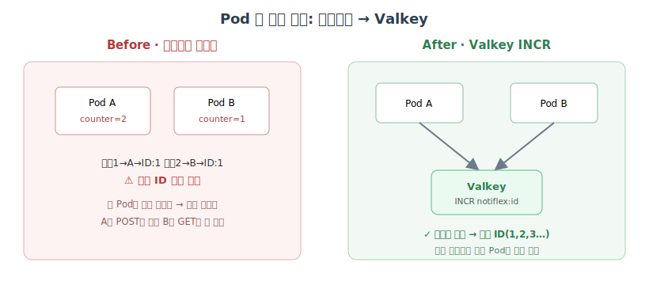
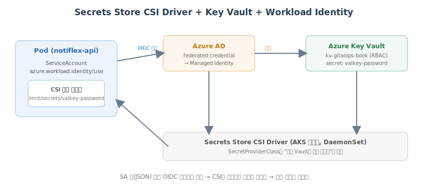
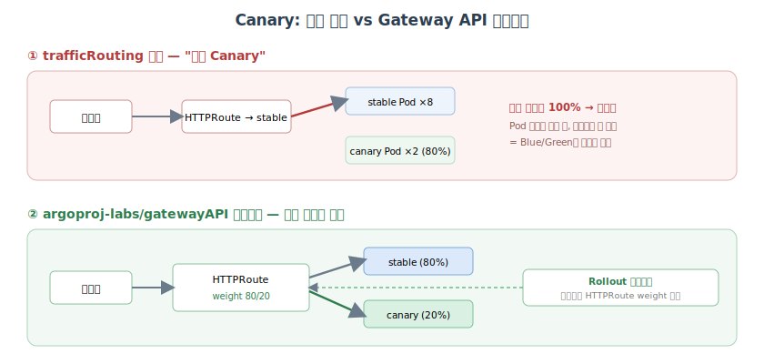

# 엔터프라이즈를 위한 기반 정비: 캐시·시크릿·Canary

## 개요

고객이 늘면서 세 가지 문제가 드러났다.

1. **API 응답 불일치**: Pod가 2개인데 각각 독립적인 메모리에 데이터를 저장한다. Pod A에 POST한 알림이 Pod B의 GET에서는 안 보인다.
2. **평문 비밀번호**: YAML에 비밀번호가 평문으로 들어 있다. Kubernetes Secret은 base64 인코딩일 뿐 암호화가 아니며, 누구나 디코딩할 수 있다.
3. **한 번에 전환되는 배포**: Blue/Green은 새 버전을 한 번에 전환한다. Preview에서 잘 됐는데 실제 트래픽에서 문제가 생기면 전체 고객이 영향을 받는다.

대형 고객사가 보안 감사를 요청해 왔다. 엔터프라이즈 고객을 받으려면 지금 구조로는 부족하다. 6장은 **Valkey**로 Pod 간 상태를 공유하고, **시크릿을 안전하게 관리**하고, **Canary 배포**로 트래픽을 점진적으로 전환한다.

> **환경 메모** — 5장에 이어 **Azure(AKS)** 기준이다. 컨텍스트 `aks-gitaiops-book`, 리소스 그룹 `rg-gitaiops-book`, 레지스트리 `acrgitaiopsbook.azurecr.io`. 앱 버전은 5장의 `v0.2.0`에서 이 장을 거치며 `v0.3.0`(Valkey) → `v0.4.0`(시크릿) → `v0.6.0`(Canary)로 나아간다.

---

## Pod 간 상태 공유: Valkey 캐시

지금까지 `/id` 엔드포인트는 인메모리 atomic counter로 ID를 생성했다. Pod가 1개일 땐 문제없지만, 2개 이상이면 각 Pod가 독립적인 카운터를 갖는다.

```text
요청 1 → Pod A → ID: 1
요청 2 → Pod B → ID: 1   ← 중복!
요청 3 → Pod A → ID: 2
```



Pod 간 상태를 공유할 **중앙 저장소**가 필요하다.

### 도구 선택 — 왜 Redis가 아니라 Valkey인가

클로드 코드는 **Valkey**를 추천했다. Redis가 2024년 라이선스를 SSPL(상용 제한)로 바꾸면서 Linux Foundation 산하에 만들어진 오픈소스 포크로, **Redis와 100% 호환**되면서 BSD 라이선스를 유지한다.

| 도구 | 라이선스 | 영속성 | INCR | 적합도 |
| --- | --- | --- | --- | --- |
| **Valkey** | BSD(안전) | ✅ | ✅ | ★★★ |
| Redis | SSPL(상용 제한) | ✅ | ✅ | ★★ |
| Memcached | BSD | ❌ | ❌ | ★ |
| DragonflyDB | BSL | ✅ | ✅ | ★ |

`/id`는 **INCR로 순차 ID**를 만들어야 하고 Pod 재시작 후에도 카운터가 유지돼야 한다. 그래서 영속성 없고 INCR도 없는 Memcached는 제외, Redis는 라이선스 이유로 제외 → Valkey가 최선이다. Redis 지식(명령어·클라이언트)을 그대로 쓸 수 있는 것도 장점이다.

### 설치 — Bitnami 차트의 함정

설치 전에, JOURNEY.md에 남아 있던 "ch6 진입 전 CPU 축소 필요" 경고 때문에 현재 노드 여유와 replicas를 먼저 확인한다(가드레일이 사전 조건을 챙긴다).

```bash
kubectl get rollout notiflex-api -n notiflex -o jsonpath='{.spec.replicas}{"\n"}'
kubectl describe node | sed -n '/Allocated resources/,/memory/p' | head -8
```

```text
2
Allocated resources:
  (Total limits may be over 100 percent, i.e., overcommitted.)
  Resource           Requests      Limits
  cpu                1450m (76%)   500m (26%)
  memory             1780Mi (39%)  1200Mi (26%)
```

CPU 76%로 Valkey 50m을 얹을 여유가 있다. Valkey를 standalone 모드로 Helm 설치한다.

```bash
helm repo add bitnami https://charts.bitnami.com/bitnami
helm repo update bitnami
helm install valkey bitnami/valkey -n notiflex --kube-context aks-gitaiops-book \
  --set architecture=standalone \
  --set auth.enabled=true \
  --set master.resources.requests.cpu=50m \
  --set master.resources.requests.memory=64Mi
```

```text
NAME: valkey
LAST DEPLOYED: Sun Jul 19 17:08:29 2026
NAMESPACE: notiflex
STATUS: deployed
REVISION: 1
TYPE: helm
** Please be patient while the chart is being deployed **

Valkey can be accessed via port 6379 on the following DNS name from within your cluster:
    valkey-primary.notiflex.svc.cluster.local

To get your password run:
    export VALKEY_PASSWORD=$(kubectl get secret valkey -n notiflex \
      -o jsonpath="{.data.valkey-password}" | base64 -d)

To connect to your Valkey server:
    kubectl port-forward --namespace notiflex svc/valkey-primary 6379:6379 &
    REDISCLI_AUTH="$VALKEY_PASSWORD" valkey-cli -h 127.0.0.1 -p 6379
```

그런데 Pod가 `Pending`에서 멈춘다. 상태를 여러 번 찍어 보면 계속 Pending이다.

```bash
for i in 1 2 3 4 5 6; do
  echo "attempt $i: $(kubectl get pod valkey-primary-0 -n notiflex \
    -o jsonpath='{.status.phase} image={.spec.containers[0].image}')"
  sleep 5
done
```

```text
attempt 1: Pending image=registry-1.docker.io/bitnami/valkey:9.1.0
attempt 2: Pending image=registry-1.docker.io/bitnami/valkey:9.1.0
...
attempt 6: Pending image=registry-1.docker.io/bitnami/valkey:9.1.0
```

원인을 보면 이미지 태그가 없다.

```bash
kubectl describe pod valkey-primary-0 -n notiflex | tail -25
```

```text
Warning  Failed  kubelet  Failed to pull image "docker.io/bitnami/valkey:9.1.0":
  manifest for bitnami/valkey:9.1.0 not found
Warning  Failed  kubelet  Error: ErrImagePull
```

> **함정** — Bitnami가 **2025년 8월부터 무료 카탈로그를 `latest` 태그로만 제한**했다. 차트가 참조하는 명시적 버전 태그(`9.1.0` 등)가 레지스트리에 존재하지 않는다. 공식 `valkey/valkey:8.1`로 바꾸려 하면 이번엔 차트가 "Unrecognized images"로 막고(`global.security.allowInsecureImages=true` 필요), 태그 정책(`:latest` 금지)과도 충돌한다.

여기서 잠깐 멈춰 **사용자에게 방식을 확인**하는 것이 가드레일의 역할이다. 결국 학습 목적상 Bitnami 기본값(`bitnami/valkey:latest`)을 쓰기로 하고, 이 **태그 정책 예외를 JOURNEY.md에 사유와 함께 기록**한다. 이때 StatefulSet이 이전 실패 스펙에 멈춰 있어 Pod를 강제 재생성해야 했고, 옛 버전이 남긴 RDB 파일이 새 버전과 포맷이 안 맞아(`Can't handle RDB format version 80`) PVC를 지우고 재생성했다.

```bash
kubectl delete pod valkey-primary-0 -n notiflex --force --grace-period=0
kubectl delete pvc valkey-data-valkey-primary-0 -n notiflex
# 재기동 대기
kubectl exec -n notiflex valkey-primary-0 -- valkey-cli --version
```

```text
pod "valkey-primary-0" deleted
persistentvolumeclaim "valkey-data-valkey-primary-0" deleted
valkey-cli 9.1.0
```

앱을 붙이기 전에 `valkey-cli`로 `INCR`이 기대대로 원자적 증가를 하는지 직접 확인한다. 비밀번호는 Secret에서 꺼내 환경변수로만 쓰고 화면·커밋에 남기지 않는다.

```bash
export VALKEY_PASSWORD=$(kubectl get secret valkey -n notiflex \
  -o jsonpath="{.data.valkey-password}" | base64 -d)
kubectl exec -n notiflex valkey-primary-0 -- sh -c \
  'REDISCLI_AUTH="$VALKEY_PASSWORD" valkey-cli INCR notiflex:id; \
   REDISCLI_AUTH="$VALKEY_PASSWORD" valkey-cli INCR notiflex:id; \
   REDISCLI_AUTH="$VALKEY_PASSWORD" valkey-cli GET notiflex:id'
```

```text
(integer) 1
(integer) 2
"2"
```

`INCR`이 순차로 오르는 것을 확인했다. 이제 앱에서 이 명령을 쓰면 된다.

### 앱 연동 — INCR로 순차 ID

`app/main.go`의 `/id` 핸들러를 인메모리 카운터에서 Valkey `INCR`로 바꾼다(`v0.3.0`). Valkey 비밀번호는 K8s Secret에서 주입한다(이 방식은 6.2에서 개선한다).

```go
// app/main.go (요지)
import "github.com/valkey-io/valkey-go"

var valkeyClient valkey.Client

func idHandler(w http.ResponseWriter, r *http.Request) {
    // 원자적 증가: 여러 Pod이 동시에 호출해도 중복 없이 순차 ID
    id, err := valkeyClient.Do(r.Context(),
        valkeyClient.B().Incr().Key("notiflex:id").Build()).ToInt64()
    if err != nil {
        w.WriteHeader(http.StatusInternalServerError)
        fmt.Fprintf(w, `{"error":%q}`+"\n", err.Error())
        return
    }
    podName := os.Getenv("POD_NAME")
    fmt.Fprintf(w, `{"id":%q,"generated_by":%q}`+"\n", fmt.Sprint(id), podName)
}

func connectValkey() (valkey.Client, error) {
    addr := os.Getenv("VALKEY_ADDR")
    password := os.Getenv("VALKEY_PASSWORD")
    // 연결 재시도 (최대 10회)
    for i := 0; i < 10; i++ {
        client, err := valkey.NewClient(valkey.ClientOption{
            InitAddress: []string{addr}, Password: password,
        })
        if err == nil { return client, nil }
        log.Printf("Valkey 연결 재시도 %d/10: %v", i+1, err)
        time.Sleep(3 * time.Second)
    }
    return nil, fmt.Errorf("valkey 연결 실패")
}
```

의존성을 추가하고 리눅스 바이너리로 빌드가 되는지 검증한다.

```bash
cd app
go get github.com/valkey-io/valkey-go@latest && go mod tidy
GOOS=linux GOARCH=amd64 CGO_ENABLED=0 go build -o /tmp/notiflex-test . && echo "BUILD OK"
```

```text
go: downloading github.com/valkey-io/valkey-go v1.0.76
go: downloading golang.org/x/sys v0.43.0
go: added github.com/valkey-io/valkey-go v1.0.76
BUILD OK
module notiflex
go 1.25
require github.com/valkey-io/valkey-go v1.0.76
```

Dockerfile도 `go.sum`을 복사하고 의존성을 받도록 고친다.

```diff
 FROM golang:1.25-alpine AS build
 WORKDIR /src
-COPY go.mod ./
+COPY go.mod go.sum ./
+RUN go mod download
 COPY main.go ./
 RUN CGO_ENABLED=0 go build -o /notiflex .
```

로컬 Docker 빌드도 통과하는지 본다(이 환경은 ACR Tasks 미지원이라 buildx로 빌드).

```bash
docker buildx build --platform linux/amd64 -t notiflex-test:local . 2>&1 | tail -6
```

```text
 => [build 3/5] RUN go mod download                         4.1s
 => [build 4/5] COPY main.go ./                             0.0s
 => [build 5/5] RUN CGO_ENABLED=0 go build -o /notiflex .   9.7s
 => exporting to image                                      0.3s
 => => naming to docker.io/library/notiflex-test:local      done
```

`rollout.yaml`에 Valkey 환경변수를 추가한다(이 시점엔 비밀번호를 K8s Secret에서 주입, 6.2에서 개선).

```yaml
# k8s/smb/rollout.yaml (env 일부)
env:
  - name: VALKEY_ADDR
    value: valkey-primary.notiflex.svc.cluster.local:6379
  - name: VALKEY_PASSWORD
    valueFrom:
      secretKeyRef:
        name: valkey
        key: valkey-password
```

CI가 이미지를 빌드·태그 갱신하고 ArgoCD가 Blue/Green으로 배포한 뒤, 외부 Gateway로 여러 번 `/id`를 호출하면 **서로 다른 Pod가 순차 ID를 공유 생성**하는 것을 확인할 수 있다.

```bash
for i in $(seq 1 6); do curl -s http://$GATEWAY_IP/id; done
```

```text
{"id":"1","generated_by":"notiflex-api-xxxx-k2m9p"}
{"id":"2","generated_by":"notiflex-api-xxxx-q7x4t"}   ← 다른 Pod인데
{"id":"3","generated_by":"notiflex-api-xxxx-k2m9p"}   ← 중복 없이
{"id":"4","generated_by":"notiflex-api-xxxx-q7x4t"}
{"id":"5","generated_by":"notiflex-api-xxxx-k2m9p"}
{"id":"6","generated_by":"notiflex-api-xxxx-q7x4t"}
```

---

## 시크릿 관리: CSI Driver + Azure Key Vault

6.1에서 Valkey 비밀번호를 K8s Secret으로 관리하고 있는데, **K8s Secret은 base64 인코딩일 뿐 암호화가 아니고 Git에 커밋할 수도 없다**. 프로덕션 수준의 시크릿 관리가 필요하다.

### 도구 선택 — CSI Driver + Key Vault + Workload Identity

원문(GCP)은 GKE Secret Manager CSI를 쓰지만, 이 프로젝트는 Azure라 대응 조합을 쓴다: **Secrets Store CSI Driver**가 Azure Key Vault에서 시크릿을 가져와 Pod에 파일로 마운트하고, **Azure AD Workload Identity**로 SA 키 없이 인증한다.

| 방식 | 저장 위치 | Git 커밋 | 회전·감사 | 적합도 |
| --- | --- | --- | --- | --- |
| **CSI Driver + Key Vault** | 외부 KMS | 불필요 | ✅ Key Vault | ★★★ |
| Sealed Secrets | 암호화해 Git | ✅ | ❌(직접 관리) | ★★ |
| External Secrets Operator | 외부 KMS | 불필요 | ✅ | ★★ |
| kubectl create secret | K8s(base64) | ❌ | ❌ | ★ |

AKS 애드온 하나로 붙는 가장 네이티브한 조합이고, 6.1의 파일 마운트 패턴을 그대로 재사용할 수 있어 CSI Driver를 택한다.



핵심 개념 셋:

- **Workload Identity**: Pod의 K8s ServiceAccount를 Azure AD 앱 등록(federated credential)과 연결해, Azure 리소스 접근 시 SA 키 대신 **OIDC 토큰**을 사용한다.
- **SecretProviderClass**: CSI Driver의 CRD로 "어떤 Key Vault의 어떤 시크릿을 가져올지" 정의한다.
- **CSI**: 시크릿을 파일 시스템처럼 마운트하는 K8s 스토리지 플러그인 표준.

### Key Vault 생성과 리소스 프로바이더 등록

```bash
az keyvault create --name kv-gitaiops-book --resource-group rg-gitaiops-book \
  --location koreacentral --enable-rbac-authorization true -o json
```

처음엔 프로바이더 미등록으로 실패한다 — 실제로 자주 만나는 지점이다.

```text
ERROR: (MissingSubscriptionRegistration) The subscription is not registered
to use namespace 'Microsoft.KeyVault'.
```

등록 후(2~3분 소요) 다시 생성한다.

```bash
az provider register --namespace Microsoft.KeyVault
# 등록 완료까지 대기
until [ "$(az provider show --namespace Microsoft.KeyVault --query registrationState -o tsv)" = "Registered" ]; do sleep 10; done
az keyvault create --name kv-gitaiops-book --resource-group rg-gitaiops-book \
  --location koreacentral --enable-rbac-authorization true
```

### Workload Identity + CSI 애드온 활성화

두 번의 `az aks update`는 **동시 실행 불가**(같은 클러스터 병렬 업데이트는 실패)라 순차로 진행한다.

```bash
az aks update --resource-group rg-gitaiops-book --name notiflex-cluster \
  --enable-workload-identity
az aks show --resource-group rg-gitaiops-book --name notiflex-cluster \
  --query "{oidc:oidcIssuerProfile.enabled, wi:securityProfile.workloadIdentity.enabled}"
```

```text
{ "oidc": true, "wi": true }
```

```bash
az aks enable-addons --resource-group rg-gitaiops-book --name notiflex-cluster \
  --addons azure-keyvault-secrets-provider
kubectl get pods -n kube-system | grep -i secret
```

```text
aks-secrets-store-csi-driver-mmbct           3/3   Running
aks-secrets-store-csi-driver-r6jqr           3/3   Running
aks-secrets-store-provider-azure-xxxxx       1/1   Running
```

### RBAC 권한 — 생성자도 데이터 접근은 별도

RBAC 인증 모드의 Key Vault는 **생성자에게 데이터 플레인 권한을 자동 부여하지 않는다**. 시크릿을 저장하려다 `Forbidden`을 만난다.

```text
ERROR: (Forbidden) Caller is not authorized to perform action on resource.
Action: 'Microsoft.KeyVault/vaults/secrets/getSecret/action'
```

내 계정에 역할을 부여한 뒤 비밀번호를 저장한다.

```bash
MY_OID=$(az ad signed-in-user show --query id -o tsv)
KV_ID=$(az keyvault show --name kv-gitaiops-book --query id -o tsv)
az role assignment create --assignee "$MY_OID" \
  --role "Key Vault Secrets Officer" --scope "$KV_ID"

# Valkey 비밀번호를 Key Vault에 저장 (평문 값은 환경변수/시크릿에서만 참조, 커밋 금지)
az keyvault secret set --vault-name kv-gitaiops-book \
  --name valkey-password --value "$VALKEY_PASSWORD" -o none
```

### federated credential과 매니페스트

User-Assigned Managed Identity를 만들고, 그 principal에 Key Vault 읽기 역할을 준다. 그리고 클러스터의 OIDC issuer를 통해 K8s ServiceAccount(`notiflex:notiflex-api`)와 **federated credential**로 잇는다 — 이 연결이 "SA 키 없는 인증"의 핵심이다.

```bash
# 1) Managed Identity 생성
az identity create --name notiflex-valkey-identity \
  --resource-group rg-gitaiops-book --location koreacentral
CLIENT_ID=$(az identity show --name notiflex-valkey-identity \
  --resource-group rg-gitaiops-book --query clientId -o tsv)
PRINCIPAL_ID=$(az identity show --name notiflex-valkey-identity \
  --resource-group rg-gitaiops-book --query principalId -o tsv)

# 2) 이 identity에 Key Vault 읽기 역할
az role assignment create --assignee "$PRINCIPAL_ID" \
  --role "Key Vault Secrets User" --scope "$KV_ID"

# 3) 클러스터 OIDC issuer + federated credential
OIDC_ISSUER=$(az aks show -g rg-gitaiops-book -n notiflex-cluster \
  --query oidcIssuerProfile.issuerUrl -o tsv)
az identity federated-credential create --name notiflex-fedcred \
  --identity-name notiflex-valkey-identity --resource-group rg-gitaiops-book \
  --issuer "$OIDC_ISSUER" \
  --subject "system:serviceaccount:notiflex:notiflex-api" \
  --audience api://AzureADTokenExchange
```

```text
OIDC issuer: https://koreacentral.oic.prod-aks.azure.com/<tenant>/<guid>/
{ "clientId": "<MANAGED_IDENTITY_CLIENT_ID>", "issuer": "https://...", "subject": "system:serviceaccount:notiflex:notiflex-api" }
```

그리고 매니페스트 3종을 작성한다.

```yaml
# k8s/smb/serviceaccount.yaml
apiVersion: v1
kind: ServiceAccount
metadata:
  name: notiflex-api
  namespace: notiflex
  annotations:
    azure.workload.identity/client-id: <MANAGED_IDENTITY_CLIENT_ID>
  labels:
    azure.workload.identity/use: "true"
```

```yaml
# k8s/smb/secretproviderclass.yaml
apiVersion: secrets-store.csi.x-k8s.io/v1
kind: SecretProviderClass
metadata:
  name: notiflex-secrets
  namespace: notiflex
spec:
  provider: azure
  parameters:
    usePodIdentity: "false"
    useVMManagedIdentity: "false"
    clientID: <MANAGED_IDENTITY_CLIENT_ID>
    keyvaultName: kv-gitaiops-book
    tenantId: <TENANT_ID>
    objects: |
      array:
        - |
          objectName: valkey-password
          objectType: secret
```

`rollout.yaml`에서 ServiceAccount·workload-identity 라벨·CSI 볼륨을 추가하고, Valkey 비밀번호 주입을 **K8s Secret env → CSI 파일 마운트**로 바꾼다(`v0.4.0`).

```diff
     metadata:
       labels:
         app: notiflex-api
+        azure.workload.identity/use: "true"
     spec:
+      serviceAccountName: notiflex-api
       containers:
         - name: notiflex-api
           env:
-            - name: VALKEY_PASSWORD
-              valueFrom:
-                secretKeyRef:
-                  name: valkey
-                  key: valkey-password
+            - name: VALKEY_PASSWORD_FILE
+              value: /mnt/secrets/valkey-password
+          volumeMounts:
+            - name: secrets
+              mountPath: /mnt/secrets
+              readOnly: true
+      volumes:
+        - name: secrets
+          csi:
+            driver: secrets-store.csi.k8s.io
+            readOnly: true
+            volumeAttributes:
+              secretProviderClass: notiflex-secrets
```

앱은 파일에서 비밀번호를 읽도록 한 줄 추가한다.

```go
// connectValkey() 안에
if pwFile := os.Getenv("VALKEY_PASSWORD_FILE"); pwFile != "" {
    if data, err := os.ReadFile(pwFile); err == nil {
        password = string(data)
    } else {
        log.Printf("VALKEY_PASSWORD_FILE 읽기 실패, VALKEY_PASSWORD로 대체: %v", err)
    }
}
```

배포 후 검증한다. 먼저 CSI가 시크릿을 **파일로** 마운트했는지 Pod 안에서 직접 확인한다(값은 출력하지 않고 존재만 확인).

```bash
POD=$(kubectl get pod -n notiflex -l app=notiflex-api -o jsonpath='{.items[0].metadata.name}')
kubectl exec -n notiflex "$POD" -- ls -l /mnt/secrets/
kubectl get secretproviderclass -n notiflex
kubectl get sa notiflex-api -n notiflex -o jsonpath='{.metadata.labels}'; echo
```

```text
-r--r--r-- 1 root root 24 Jul 19 09:40 valkey-password    ← 파일로 마운트됨

NAME               AGE
notiflex-secrets   3m

{"azure.workload.identity/use":"true"}
```

이제 `/id`가 여전히 카운터 연속성을 유지하는지 확인한다. 6.1에서 이미 22까지 올라간 카운터라면, 재배포 후에도 이어서 증가해야 한다.

```bash
for i in $(seq 1 3); do curl -s http://$GATEWAY_IP/id; done
```

```text
{"id":"23","generated_by":"notiflex-api-xxxx-a1b2c"}
{"id":"24","generated_by":"notiflex-api-xxxx-d3e4f"}
{"id":"25","generated_by":"notiflex-api-xxxx-a1b2c"}
```

카운터가 22 이후로 이어진다는 것은 **SA 키 없이** Key Vault의 시크릿이 파일로 주입되어 Valkey 인증이 성공했다는 뜻이다. CSI 파일 마운트라 앱은 재시도 없이 첫 시도에 연결된다(연결 재시도 로그가 없다).

```bash
kubectl logs -n notiflex "$POD" | grep -i valkey | head -3
```

```text
2026/07/19 09:40:31 valkey connected: valkey-primary.notiflex.svc.cluster.local:6379
```

---

## 점진적 배포: Canary

대형 고객사를 서비스하면 "한 번에 전환"이 부담스럽다. **Canary**는 새 버전에 트래픽을 조금씩 보내며 문제가 없는지 확인한다. 문제가 생기면 소수만 영향받고 즉시 롤백된다.

### 세 전략 비교

| 전략 | 전환 방식 | 롤백 속도 | 리소스 | 위험도 |
| --- | --- | --- | --- | --- |
| Rolling Update | Pod 순차 교체 | 느림 | 1x | 중간 |
| Blue/Green | 0→100% 즉시 | 매우 빠름(셀렉터) | 2x | 낮음 |
| **Canary** | 20→50→80→100% | 빠름(abort) | 1.2x | **가장 낮음** |

이미 Argo Rollouts를 쓰므로 새 도구 없이 `strategy.blueGreen`을 `strategy.canary`로 바꾸면 된다.

- `setWeight`: canary Pod로 보내는 트래픽 비율
- `pause`: 다음 단계로 넘어가기 전 대기(`{duration: 30s}`)
- `abort`: 문제 발견 시 즉시 stable로 복원

### Canary 전략 적용 — 그리고 함정

`rollout.yaml`의 전략을 바꾼다.

```diff
   strategy:
-    blueGreen:
-      activeService: notiflex-api
-      previewService: notiflex-api-preview
-      autoPromotionEnabled: true
-      autoPromotionSeconds: 30
+    canary:
+      canaryService: notiflex-api-preview
+      stableService: notiflex-api
+      steps:
+      - setWeight: 20
+      - pause: {duration: 30s}
+      - setWeight: 50
+      - pause: {duration: 30s}
+      - setWeight: 80
+      - pause: {duration: 30s}
```

가드레일 순서대로 **git push를 먼저** 하고, 기존 Rollout을 삭제해 ArgoCD가 새 스펙을 적용하게 한다.

```bash
git add k8s/smb/rollout.yaml
git commit -m "feat(ch6.3): Blue/Green -> Canary 전략 전환 (20/50/80/100, 30초 pause)"
git push
kubectl delete rollout notiflex-api -n notiflex
kubectl annotate application notiflex-smb -n argocd argocd.argoproj.io/refresh=hard --overwrite
kubectl get rollout notiflex-api -n notiflex -o jsonpath='{.spec.strategy.canary.steps}'; echo
```

```text
rollout.argoproj.io "notiflex-api" deleted
application.argoproj.io/notiflex-smb annotated
[{"setWeight":20},{"pause":{"duration":"30s"}},{"setWeight":50},{"pause":{"duration":"30s"}},{"setWeight":80},{"pause":{"duration":"30s"}}]
```

`v0.5.0`을 배포하고 진행 상황을 지켜보면 단계별로 `Paused`가 된다.

```bash
for i in $(seq 1 6); do
  echo "attempt $i: $(kubectl get rollout notiflex-api -n notiflex \
    -o jsonpath='phase={.status.phase} step={.status.currentStepIndex}')"
  sleep 30
done
```

```text
attempt 1: phase=Progressing step=1
attempt 2: phase=Paused step=1
attempt 3: phase=Paused step=3
attempt 4: phase=Paused step=5
```

step 5(=80% 가중치) 단계에서 실제 트래픽을 확인하는데 — **전부 구버전만 반환한다.**

```bash
GW_IP=$(kubectl get gateway notiflex-gateway -n notiflex -o jsonpath='{.status.addresses[0].value}')
for i in $(seq 1 15); do curl -s "http://$GW_IP/version"; done | sort | uniq -c
```

```text
     15 {"version":"v0.4.0"}    ← 80% canary인데 트래픽이 전혀 안 나뉨!
```



> **핵심 함정 — "가짜 Canary"** — `trafficRouting`을 설정하지 않으면 Argo Rollouts는 **기본 Canary**로 동작한다. 이는 **Pod 개수만 비율대로 맞출 뿐, 실제 사용자 트래픽이 어디로 가는지는 신경 쓰지 않는다.** HTTPRoute가 stable Service 하나에만 고정 라우팅돼 있어, canary Pod이 80%로 떠 있어도 실제 요청은 마지막 100% 승격 시점에야 한 번에 전환된다. **Blue/Green과 동일한 위험 프로파일**이며 Canary의 이점이 전혀 없다.

### 진짜 가중치 분산 — Gateway API 트래픽 라우터 플러그인

실제 가중치 기반 분산을 하려면 **`argoproj-labs/rollouts-plugin-trafficrouter-gatewayapi`** 플러그인이 필요하다. 네 가지를 손봐야 한다.

**(1) 컨트롤러에 플러그인 등록** (Helm values, 컨트롤러 재시작 시 자동 다운로드)

```bash
helm upgrade argo-rollouts argo/argo-rollouts -n argo-rollouts \
  --set-json 'controller.trafficRouterPlugins=[{"name":"argoproj-labs/gatewayAPI","location":"https://github.com/argoproj-labs/rollouts-plugin-trafficrouter-gatewayapi/releases/download/v0.16.0/gatewayapi-plugin-linux-amd64"}]'
kubectl logs -n argo-rollouts deploy/argo-rollouts | grep -i "plugin\|gatewayapi"
```

```text
level=info msg="Downloading plugin argoproj-labs/gatewayAPI from: https://github.com/.../v0.16.0/gatewayapi-plugin-linux-amd64"
level=info msg="Download complete, it took 1.9s"
level=info msg="Init plugin argoproj-labs/gatewayAPI"
```

컨트롤러가 새 values로 롤링 재시작되는지도 확인한다.

```bash
for i in 1 2 3 4 5 6; do
  echo "attempt $i: $(kubectl get pods -n argo-rollouts \
    -l app.kubernetes.io/name=argo-rollouts --no-headers | awk '{print $2}')"
  sleep 5
done
```

```text
attempt 1: 0/1
attempt 2: 0/1
attempt 3: 1/1
```

**(2) ClusterRole 권한 보강** — 기본엔 `get/list/watch`만 있어 `update/patch`가 빠져 있다. 먼저 현재 권한을 확인하면 실제로 빠져 있는 게 보인다.

```bash
kubectl get clusterrole argo-rollouts -o yaml | grep -A6 "gateway.networking.k8s.io"
```

```text
  - gateway.networking.k8s.io
    resources:
    - httproutes
    verbs:
    - get
    - list
    - watch          ← update/patch 없음 → 플러그인이 weight를 못 바꿈
```

```bash
kubectl patch clusterrole argo-rollouts --type=json \
  -p='[{"op":"add","path":"/rules/-","value":{"apiGroups":["gateway.networking.k8s.io"],"resources":["httproutes"],"verbs":["get","list","watch","update","patch"]}}]'
```

**(3) HTTPRoute에 canary Service backendRef 추가**

```diff
     backendRefs:
     - name: notiflex-api
+      kind: Service
       port: 80
+    - name: notiflex-api-preview
+      kind: Service
+      port: 80
```

**(4) Rollout에 trafficRouting.plugins 설정**

```diff
     canary:
       canaryService: notiflex-api-preview
       stableService: notiflex-api
+      trafficRouting:
+        plugins:
+          argoproj-labs/gatewayAPI:
+            httpRoute: notiflex-route
+            namespace: notiflex
```

### selfHeal 간섭 방지 — ignoreDifferences

플러그인은 Canary 진행 중 HTTPRoute에 라벨(`rollouts.argoproj.io/gatewayapi-canary: in-progress`)을 붙이고 weight를 직접 수정한다. 그런데 **ArgoCD의 selfHeal이 이걸 되돌려 버릴 수 있다.** Application에 `ignoreDifferences`를 추가해 진행 중 변경을 무시하게 한다.

```yaml
# argocd/notiflex-smb.yaml
  ignoreDifferences:
    - group: gateway.networking.k8s.io
      kind: HTTPRoute
      jqPathExpressions:
        - 'select(.metadata.labels["rollouts.argoproj.io/gatewayapi-canary"] == "in-progress") | .spec.rules'
```

### 재검증 — 실제로 트래픽이 나뉜다

`v0.6.0`을 배포하고 50% 단계에서 실측하면, 이번엔 실제로 분산된다.

```bash
kubectl get httproute notiflex-route -n notiflex -o yaml | grep -A1 weight
for i in $(seq 1 20); do curl -s "http://$GW_IP/version"; done | sort | uniq -c
```

```text
    weight: 50   # stable
    weight: 50   # canary
      8 {"version":"v0.5.0"}     ← 실제로 분산됨 (근사 40%)
     12 {"version":"v0.6.0"}     ← (근사 60%)
```

Canary 진행 중에는 플러그인이 HTTPRoute에 `in-progress` 라벨을 붙이고 weight를 단계마다 갱신한다.

```bash
kubectl get httproute notiflex-route -n notiflex \
  -o jsonpath='{.metadata.labels}'; echo
```

```text
{"rollouts.argoproj.io/gatewayapi-canary":"in-progress"}
```

단계가 진행되며 weight가 20/80 → 50/50 → 80/20으로 바뀌고, 100% 승격 후에는 `in-progress` 라벨이 자동 제거된다.

```bash
for i in 1 2 3 4 5 6; do
  W=$(kubectl get httproute notiflex-route -n notiflex \
    -o jsonpath='{.spec.rules[0].backendRefs[*].weight}')
  echo "attempt $i: phase=$(kubectl get rollout notiflex-api -n notiflex -o jsonpath='{.status.phase}') weight=[$W]"
  sleep 30
done
```

```text
attempt 1: phase=Paused step=1 weight=[80 20]
attempt 2: phase=Paused step=3 weight=[50 50]
attempt 3: phase=Paused step=5 weight=[20 80]
attempt 4: phase=Healthy weight=[100 0]
```

최종 100% 승격 후 실측하면 전부 새 버전이고, `in-progress` 라벨도 사라진다.

```bash
for i in $(seq 1 10); do curl -s "http://$GW_IP/version"; done | sort | uniq -c
kubectl get rollout notiflex-api -n notiflex \
  -o jsonpath='{.status.phase} step={.status.currentStepIndex}'; echo
```

```text
     10 {"version":"v0.6.0"}
Healthy step=6
```

이제 canary는 **Pod 비율이 아니라 실제 요청 비율**로 새 버전을 검증한다.

### abort — 20% 노출 중 문제 발견 시 즉시 복원

Canary의 진짜 이점은 "소수 노출 중 이상하면 멈춘다"이다. 20% 단계에서 에러율이 튀면 `abort`로 즉시 stable로 되돌린다. 새 Pod를 다시 띄우는 게 아니라 weight를 0으로 되돌리는 것이라 사실상 즉시다.

```bash
# 20% 단계에서 canary 버전에 문제가 보인다고 하자
kubectl argo rollouts abort notiflex-api -n notiflex
kubectl get httproute notiflex-route -n notiflex \
  -o jsonpath='{.spec.rules[0].backendRefs[*].weight}'; echo
for i in $(seq 1 8); do curl -s "http://$GW_IP/version"; done | sort | uniq -c
```

```text
rollout 'notiflex-api' aborted
100 0                          ← 트래픽 전량 stable로 복귀
      8 {"version":"v0.5.0"}   ← 전부 구버전 (영향받은 사용자는 20%뿐이었다)
```

수정된 이미지로 다시 밀면 canary가 처음 단계부터 재개된다. **영향 범위가 20%로 제한**된다는 것이 Blue/Green(0→100%)과의 결정적 차이다.

---

## 마무리: claude-context/로 아키텍처 스냅샷 남기기

4장에서 Memory에 작업 맥락을, 5장에서 ADR에 영구 결정을 기록했다. 6장에는 하나가 더 필요하다 — **지금 시스템이 어떤 모양인지 보여주는 그림**이다. SMB에서 엔터프라이즈로 넘어가며 새 멤버가 합류하고, 클로드 코드도 점점 더 많은 컴포넌트를 동시에 다뤄야 한다.

지식 문서를 세 층으로 나눈다.

| 문서 | 역할 | 공유 |
| --- | --- | --- |
| `CLAUDE.md` | 팀 코딩 컨벤션·가드레일 메타데이터. 매 대화 자동 로드 | Git |
| `.claude/memory` | 개인 노트("왜 Valkey를 골랐지?") | 나만 |
| `claude-context/` | **현재 아키텍처 스냅샷**("지금 뭐가 어디에 어떻게") | Git |
| `docs/` (ADR) | 결정 누적 기록 | Git |

`claude-context/architecture.md`는 **클러스터를 직접 조회한 실제 값**으로 채운다.

```bash
kubectl get app -n argocd -o custom-columns=NAME:.metadata.name,SYNC:.status.sync.status,HEALTH:.status.health.status
kubectl get ds -A
az aks show -g rg-gitaiops-book -n notiflex-cluster --query "{ingressProfile:ingressProfile}" -o json
```

정리되는 6개 섹션: **3층 지식 구조 / 클러스터 토폴로지 / 컴포넌트 다이어그램(사용자 → Gateway → HTTPRoute 가중치 분산 → Service → Rollout → Pod → Valkey/Key Vault) / 배포 파이프라인 / 관측 가능성 / 주요 네임스페이스**. 구조가 복잡해지기 전에 현재 상태를 기록해 두면, 클로드 코드가 새 컴포넌트를 추가할 때 기존 구조와 충돌하지 않는 방향을 제안할 수 있다.

---

## 트러블슈팅: 이 장에서 실제로 막혔던 지점

### ① Valkey Pod가 ImagePullBackOff

Bitnami 무료 카탈로그가 `latest`만 제공해 버전 태그 이미지가 없다. Bitnami 기본값(`:latest`)을 쓰거나, 공식 `valkey/valkey`로 전환한다(차트 보안검증 우회 필요). 이전 버전이 남긴 **RDB 포맷 불일치**는 PVC 삭제 후 재생성으로 푼다.

### ② Key Vault 접근이 Forbidden

RBAC 모드 Key Vault는 생성자에게 데이터 권한을 자동 부여하지 않는다. `Key Vault Secrets Officer` 역할을 명시적으로 할당한다. 그 전에 `Microsoft.KeyVault` 프로바이더가 구독에 등록돼 있어야 한다(`az provider register`).

### ③ Canary인데 트래픽이 안 나뉜다

`trafficRouting` 미설정 = 가짜 Canary(Pod 비율만). `argoproj-labs/gatewayAPI` 플러그인 설치 + ClusterRole `update/patch` 보강 + HTTPRoute canary backendRef + `ignoreDifferences`까지 갖춰야 실제 분산된다.

### ④ 플러그인 weight를 selfHeal이 되돌린다

ArgoCD가 canary 중 붙은 라벨/weight를 원복하려 한다. Application `ignoreDifferences`로 `in-progress` 상태의 `.spec.rules`를 무시한다.

### 최종 검증 체크리스트

| 항목 | 명령 | 기대 |
| --- | --- | --- |
| Valkey 상태 공유 | `curl .../id` ×6 | 서로 다른 Pod가 순차 ID |
| CSI 시크릿 마운트 | Pod에 `/mnt/secrets/valkey-password` | 존재, 인증 성공 |
| SA 키 없음 | ServiceAccount에 `workload.identity/use` | true |
| Canary 실제 분산 | `curl .../version` ×20 | stable/canary 비율대로 혼재 |
| 승격 완료 | `get rollout` | `Healthy`, in-progress 라벨 제거 |

---

## 핵심 인사이트

- **상태는 밖으로 뺀다**: 확장(replicas≥2)의 전제는 stateless다. 카운터·세션 같은 상태는 Valkey 같은 중앙 저장소로 빼야 Pod가 늘어도 일관된다.
- **base64는 암호화가 아니다**: 시크릿은 외부 KMS(Key Vault)에 두고, Workload Identity로 **키 파일 없이** 인증하는 것이 프로덕션의 기본이다.
- **"보이는 Canary"와 "진짜 Canary"는 다르다**: 단계 숫자가 올라가도 실제 트래픽이 안 나뉘면 Blue/Green과 같다. 트래픽 라우터(Gateway API 플러그인)가 있어야 소수 노출의 이점이 생긴다.
- **자동화끼리도 충돌한다**: ArgoCD selfHeal과 Rollouts 플러그인처럼 서로 다른 자동화가 같은 리소스를 만지면 `ignoreDifferences`로 경계를 그어야 한다.
- **현재 상태를 그림으로 남긴다**: Memory(나)·ADR(결정)·claude-context(현재 구조)의 3층으로 나눠야 사람과 AI가 같은 그림에서 출발한다.
